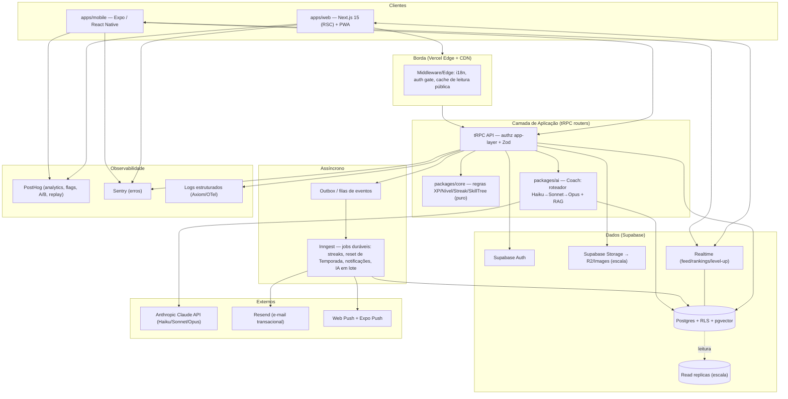
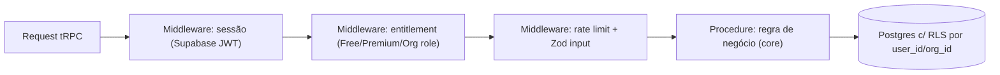
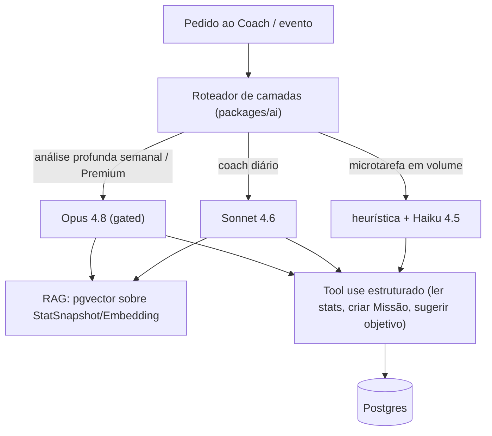

# 07 — Arquitetura Técnica

> **Documento canônico.** Define a arquitetura técnica completa do Rise: stack, fronteiras,
> modelo de API, autorização, tempo real, jobs duráveis, segurança, performance, escala,
> observabilidade, SEO, acessibilidade, i18n, testes e CI/CD. É a fonte da verdade de engenharia
> e prevalece sobre qualquer improviso de implementação. Não contradiz o canon (`docs/00-canon.md`):
> aprofunda-o. Quando esta arquitetura discorda do brief, a divergência é justificada com
> alternativa melhor.

O Rise é um "videogame da vida real" para milhões de usuários. Isso impõe três tensões que toda
decisão aqui resolve ao mesmo tempo: **feedback AAA imediato** (level-up, microinterações, latência
de registro de ação imperceptível), **type-safety ponta a ponta** entre web e mobile compartilhando
domínio, e **unit economics de IA** que sobreviva à escala. A regra-mestre do produto vale também
para a engenharia: **construir o Loop Solo impecável antes do social** — a arquitetura é desenhada
para que a Fase 2 (Feed, Guildas, Rankings) e a Fase 3 (B2B) entrem sem reescrita, mas nenhuma
complexidade social/realtime é paga antes da hora.

---

## 1. Visão de alto nível

### 1.1 Princípios arquiteturais inegociáveis

| Princípio | Como se manifesta |
|---|---|
| **Domínio no centro** | Regras de XP, níveis, streaks e skill trees vivem em `packages/core`, puras e testáveis, sem dependência de framework. Web, mobile e jobs consomem o mesmo core. |
| **Type-safety ponta a ponta** | tRPC + Drizzle + Zod: um único grafo de tipos do banco ao componente, web e mobile. Refactor quebra no compilador, não em produção. |
| **Servidor é a verdade de progresso** | XP, nível e recompensas são **sempre** computados no servidor (anti-cheat). O cliente faz *optimistic UI* para sensação instantânea, mas o ledger é autoritativo. |
| **Escala desde o dia 1, complexidade só quando necessária** | Postgres gerenciado, edge caching e jobs duráveis estão na arquitetura desde já; sharding e read replicas são *playbooks documentados*, ativados por gatilho de métrica — não pré-otimização. |
| **Honestidade by design também na infra** | XP imutável e auditável (ledger append-only); Faíscas e cosméticos isolados do caminho de progresso para que dinheiro *fisicamente* não consiga tocar XP/nível/ranking. |

### 1.2 Diagrama de alto nível



### 1.3 Fluxo crítico — "registrar uma ação ganha XP" (o coração do Loop Solo)

```mermaid
sequenceDiagram
  participant U as Usuário (Web/Mobile)
  participant T as tRPC (actions.log)
  participant Z as Zod (validação)
  participant C as core (calcXP, applyLevel)
  participant DB as Postgres (tx)
  participant RT as Realtime
  participant Q as Outbox→Inngest

  U->>T: log(actionType, lifeAreaId, payload)  [optimistic UI dispara animação local]
  T->>Z: valida entrada + entitlements + rate limit
  T->>C: calcula XP e deltas de nível/skilltree
  T->>DB: BEGIN — insere XPGrant (append-only), atualiza UserStat, Streak, evento outbox
  DB-->>T: COMMIT (XP autoritativo)
  T-->>U: resultado real (reconcilia optimistic; level-up confirmado)
  DB-->>RT: muda stat → push p/ feed/ranking do próprio usuário
  Q->>Q: evento "action.logged" → Inngest (missões, conquistas, RAG embedding, IA)
```

O cliente nunca espera a IA nem os jobs para celebrar. A latência percebida é a do `INSERT` +
commit (alvo p95 < 200 ms). Tudo o que é "caro" (recalcular conquistas, gerar embedding para o
Coach, avaliar missões compostas) acontece **depois**, via outbox → Inngest, de forma idempotente.

---

## 2. Stack: escolhas e justificativas (com alternativas recusadas)

A stack canônica está fixada em `docs/00-canon.md`. Aqui registramos o *porquê* de cada fronteira
e por que recusamos as alternativas — o nível de detalhe que um novo engenheiro precisa para não
re-litigar decisões já tomadas.

### 2.1 Monorepo — Turborepo + pnpm

**Decisão:** monorepo desde o dia 1 com Turborepo (orquestração de build/cache) + pnpm (workspaces,
store eficiente, links determinísticos).

**Por quê:** web e mobile **compartilham domínio, tipos, design tokens e o cliente tRPC**. Sem
monorepo, esse compartilhamento vira publicação de pacotes versionados — atrito absurdo para um time
pequeno em alta velocidade. O cache remoto do Turbo torna o CI barato mesmo com muitos pacotes.

**Alternativas recusadas:** Nx (mais poderoso, porém mais cerimonioso e com curva maior do que
precisamos); polyrepo (mata o compartilhamento de tipos, que é justamente o nosso diferencial de DX);
Lerna (legado, sem o cache de tasks do Turbo).

### 2.2 ORM — Drizzle (não Prisma)

**Decisão:** Drizzle. Já formalizado em ADR (ver §15 e `docs/adr/0001`).

**Por quê:** SQL-first com controle fino de queries e índices é **crítico** para os caminhos quentes
do Rise — feeds, rankings/ligas e agregações de stats. Footprint menor e cold-start mais rápido em
serverless/edge; migrations e schema em TS sem engine binária separada; melhor fit com pgvector.

**Por que recusamos Prisma:** a "mágica" do Prisma esconde o SQL exatamente onde precisamos enxergá-lo
(índices compostos para leaderboard, `EXPLAIN` de agregações). O Prisma Engine adiciona cold-start e
peso em ambiente serverless. O ecossistema maior do Prisma não compensa a perda de controle a escala
de milhões. **Custo aceito:** DX de modelagem menos "mágica" e ecossistema menor — mitigado por
`packages/db` encapsulando queries comuns.

### 2.3 API — tRPC (não REST/GraphQL)

**Decisão:** tRPC como camada de API primária, consumida por web e mobile, com TanStack Query para
server state e Zustand para estado de UI local.

**Por quê:** type-safety ponta a ponta sem geração de código nem schema duplicado. Para um produto
com **um único cliente conceitual em duas plataformas** (mesmo time, mesmo domínio), tRPC dá a maior
velocidade: renomear um campo no router quebra o componente no compilador.

**Alternativas recusadas:**
- **REST + OpenAPI:** exige manter contrato + geração de tipos; mais boilerplate, mais drift. Justifica-se
  quando há consumidores externos heterogêneos — não é nosso caso na Fase 1/2.
- **GraphQL:** resolve over/under-fetching e é ótimo para muitos consumidores externos, mas traz peso
  operacional (gateway, N+1, complexidade de cache/autorização por campo) que não pagamos com um cliente
  controlado. **Porta aberta:** se a Fase 3 (B2B) ou parceiros exigirem uma API pública, expomos um
  **gateway REST/GraphQL fino na frente dos mesmos serviços de domínio** — o core não muda.

### 2.4 Backend/Banco — Supabase (não Postgres self-hosted + backend próprio)

**Decisão:** Supabase = Postgres gerenciado + Auth + Storage + Realtime + RLS.

**Por quê:** consolida cinco peças (DB, auth, storage, realtime, segurança a nível de linha) num único
produto coeso, com Postgres *de verdade* por baixo (sem lock-in de modelo de dados). Para um time
fundador, isso é **meses de infra que não construímos**, sem abrir mão de SQL puro e extensões
(pgvector). RLS dá defense-in-depth de graça.

**Alternativas recusadas:**
- **Postgres self-hosted + backend Node próprio (NestJS/Fastify):** controle máximo, mas assume-se o
  fardo de auth, realtime, storage, backups, HA e RLS na unha — desperdício de foco pré-PMF.
- **Firebase:** ótimo realtime e DX mobile, mas modelo de dados NoSQL é hostil às nossas agregações
  relacionais (rankings, ledger de XP, joins de stats) e ao pgvector.
- **PlanetScale (MySQL):** escala de escrita excelente, mas sem pgvector nativo e sem o pacote
  integrado auth/realtime/RLS. Trocaríamos integração por escala que ainda não precisamos.

> **Estratégia de saída anti-lock-in:** como o núcleo é Postgres padrão + Drizzle, migrar do Supabase
> para Postgres gerenciado (RDS/Cloud SQL) + serviços avulsos é um *playbook*, não uma reescrita. Auth e
> Realtime são as peças mais acopladas; isolamo-las atrás de interfaces em `packages/core`.

### 2.5 Mobile — Expo / React Native (não 100% nativo)

**Decisão:** Expo + React Native + NativeWind, compartilhando primitivos de UI e design tokens com a web.

**Por quê:** um time, uma base de domínio, dois alvos. Expo entrega push nativo (requisito de engajamento
diário desde a arquitetura), OTA updates e build na nuvem (EAS). O compartilhamento de `core`/`ui/tokens`
elimina divergência de regras entre plataformas.

**Por que não nativo puro (Swift/Kotlin):** dobraria o time e duplicaria toda a lógica de progressão —
custo proibitivo sem ganho proporcional para o nosso tipo de app (UI rica, não jogo 3D). **PWA é ponte,
não destino:** valida cedo no browser, mas não substitui push/ícone na home/performance nativa — por isso
Expo está na arquitetura desde a Fase 1.

### 2.6 Jobs duráveis — Inngest (não cron simples)

**Decisão:** Inngest para workflows duráveis: streaks, reset de Temporada, notificações, análises de IA
em lote, fan-out de feed.

**Por quê:** essas tarefas precisam de **retries, idempotência, steps, concorrência controlada e
agendamento** — não de um `cron` que dispara e reza. Reset de Temporada para milhões de usuários é um
fan-out com checkpoints; análise semanal do Coach (Opus) é cara e tem de ser em lote, throttled e
retomável. Inngest dá tudo isso com DX em TS e observabilidade própria.

**Alternativas recusadas:**
- **Supabase cron + Edge Functions:** ok para 1-2 tarefas triviais; vira espaguete de estado e retry
  manual nos workflows multi-step. Mantemos como fallback para crons *triviais* somente.
- **Trigger.dev:** concorrente forte e válido; escolhemos Inngest pela maturidade do modelo de eventos e
  *step functions*. **Reavaliável** se custos/limites mudarem (documentar em ADR se trocar).
- **Filas brutas (SQS/BullMQ):** mais controle, muito mais código de orquestração e durabilidade que
  Inngest já entrega.

### 2.7 IA — Claude em camadas (unit economics primeiro)

**Decisão:** Anthropic Claude API em três camadas por custo, encapsulada em `packages/ai`:

| Camada | Modelo | Uso | Gating |
|---|---|---|---|
| Microtarefas em volume | heurísticas + `claude-haiku-4-5` | classificação de ação, normalização, tags, missões simples | Free |
| Coach do dia a dia | `claude-sonnet-4-6` | conversa do Coach, insights diários, sugestão de missão | Free (com limites) |
| Análise profunda | `claude-opus-4-8` | análise semanal de padrões, replanejamento de rotina | **Premium** |

Tool use estruturado + RAG via **pgvector** sobre as estatísticas do próprio usuário (`StatSnapshot`/
`Embedding`). Recursos pesados ficam no Premium — **profundidade, nunca poder competitivo** (guardrail
do canon).

**Por quê:** custo de IA é o item que mata margem em escala. Um roteador que resolve a maioria com
heurística/Haiku e só escala para Sonnet/Opus quando o valor justifica é a diferença entre margem
saudável e prejuízo por usuário. **Detalhe na §11.**

---

## 3. Monorepo: apps e packages

```
rise/
├─ apps/
│  ├─ web/            # Next.js 15 (App Router, RSC) + PWA. SEO, marketing, app autenticado.
│  └─ mobile/         # Expo / RN (Fase 1 tardia → 2). Push nativo, home presence.
├─ packages/
│  ├─ core/           # DOMÍNIO PURO: XP, Nível de Área, Nível Rise, Streak, SkillTree, Missão,
│  │                  # Conquista, regras de Temporada. Zero deps de framework. 100% testável.
│  ├─ ui/             # Componentes compartilhados (RN primitives + web via NativeWind/Tailwind)
│  │  └─ tokens/      # Design tokens (cor, tipografia, espaçamento, motion) — fonte única.
│  ├─ db/             # Drizzle schema, migrations, queries encapsuladas, RLS policies (SQL).
│  ├─ ai/             # Coach: roteador de modelos, prompts, tool defs, RAG (pgvector), camadas.
│  ├─ api/            # tRPC routers + procedures + middlewares (authz, rate limit, ctx).
│  └─ config/         # ESLint, tsconfig, tailwind/nativewind preset, env schema (Zod), i18n base.
└─ turbo.json         # pipeline build/test/lint/typecheck com cache remoto.
```

**Regra de dependência (limpa, sem ciclos):** `core` não importa ninguém. `db`, `ai`, `api` importam
`core`. `apps/*` importam `api`, `ui`, `config`. **Nada em `apps/*` reimplementa regra de domínio** —
se um cálculo de XP aparecer fora de `core`, é bug de arquitetura.

### Fronteira Web (RSC) × Mobile (Expo) × Core compartilhado

| Camada | Web | Mobile | Compartilhado |
|---|---|---|---|
| Renderização | React Server Components + Client Components | React Native (client) | — |
| Estilo | Tailwind | NativeWind | `ui/tokens` (fonte única) |
| Dados | tRPC via RSC (server) + TanStack Query (client) | tRPC + TanStack Query | cliente tRPC tipado |
| Domínio | — | — | `core` (XP, níveis, streaks, skill trees) |
| Estado UI | Zustand | Zustand | padrões em `ui` |

**RSC como vantagem:** páginas públicas (marketing, perfis públicos de progresso na Fase 2) e dados de
leitura do app autenticado renderizam no servidor — bom para SEO, TTFB e para **não vazar lógica/segredos**
ao cliente. Mutações e interatividade rica (animações de level-up) ficam em Client Components.

---

## 4. Modelo de API (tRPC) e autorização

### 4.1 Estrutura de routers

Routers por domínio, espelhando as entidades centrais: `auth`, `lifeArea`, `action`, `xp`, `level`,
`skillTree`, `streak`, `quest`, `achievement`, `season`, `challenge`, `ranking`, `coach`, `stats`,
`sparks`, `subscription`, e (Fase 2/3) `social`, `guild`, `feed`, `org`.

Tipos de procedure:
- `publicProcedure` — landing, conteúdo público, health.
- `protectedProcedure` — exige sessão Supabase válida (middleware injeta `ctx.user`).
- `premiumProcedure` — exige entitlement Premium (Coach Opus, analytics avançado).
- `orgProcedure` — exige papel em `Organization` (Fase 3), com escopo de time.

### 4.2 Autorização em duas camadas (app-layer + RLS)

> **Autorização principal na camada de aplicação (tRPC); RLS como defense-in-depth.** É o modelo do
> canon e o adotamos integralmente.



- **App-layer (primária):** toda regra de quem-pode-o-quê vive nos middlewares/procedures tRPC, onde
  temos contexto rico (plano, papel, limites, estado do recurso). É expressiva e testável.
- **RLS (defesa em profundidade):** tabelas sensíveis (`XPGrant`, `UserStat`, `Subscription`, dados de
  `Coach`, `SparksWallet`, e tudo de B2B) têm políticas RLS por `user_id`/`org_id`. Se um bug deixar
  passar uma query mal-escopada, **o banco recusa**. Realtime usa RLS para garantir que cada cliente só
  recebe o que pode ver.
- **Princípio anti pay-to-win na authz:** as procedures que concedem XP/nível/ranking **não aceitam**
  nenhum parâmetro vindo de compra. Escrita em `XPGrant` só ocorre por ação real validada; escrita em
  `SparksWallet`/`Inventory` nunca toca progresso. A separação é estrutural, não só convencional.

---

## 5. Tempo real (Realtime)

**Uso na Fase 1 (Loop Solo):** confirmação de level-up cross-device, atualização de stats do próprio
usuário, sincronização de streak entre web e mobile.

**Uso na Fase 2 (Social):** Feed de progresso, Rankings/Ligas ao vivo, atividade de Guilda, presença em
Desafios.

**Estratégia:**
- **Supabase Realtime (Postgres changes / broadcast)** para eventos de baixa cardinalidade e escopo de
  usuário/guilda, sempre filtrados por **RLS**.
- **Realtime é entrega, não verdade:** o estado autoritativo é o Postgres. Realtime empurra deltas; o
  cliente reconcilia via TanStack Query (invalidate/optimistic). Nunca computamos XP "no canal".
- **Anti-thundering-herd em escala:** Feed e Ranking globais **não** são "todo mundo escuta tudo".
  Usamos **fan-out na escrita** (outbox → Inngest materializa `FeedItem` por seguidor / atualiza
  agregados de liga) + Realtime só no recorte do usuário/guilda. Rankings globais são lidos de
  **agregados materializados com cache**, não de subscriptions massivas.
- **Gatilho de evolução:** se o volume de canais estourar limites do Supabase Realtime, isolamos o
  transporte atrás de uma interface e avaliamos um serviço dedicado de pub/sub (ex.: Cloudflare/Ably) —
  decisão de Fase 2/3, documentável em ADR.

---

## 6. Jobs duráveis (Inngest)

Tudo assíncrono passa por **outbox transacional** (evento gravado na mesma transação da mutação) →
consumido pelo Inngest. Isso garante **exactly-once efetivo** e idempotência.

| Workflow | Gatilho | Resumo |
|---|---|---|
| **Avaliação de Streak** | cron diário por fuso + evento de ação | fecha o dia, calcula sequência, aplica bônus saudável; **nunca punição tóxica** (canon). Janela de carência configurável. |
| **Reset de Temporada** | fim da janela da `Season` | fan-out com checkpoints: encerra rankings, distribui recompensas **cosméticas**, abre nova Temporada. Idempotente e retomável. |
| **Notificações** | eventos (level-up, missão pronta, streak em risco) | Web Push + Expo Push + e-mail (Resend), com **calibração anti dark pattern** (sem FOMO/culpa; frequência limitada). |
| **IA em lote** | cron semanal (Premium) | análise profunda do Coach (Opus): throttled, em fila, com orçamento de custo por usuário. |
| **Embeddings/RAG** | `action.logged` | gera/atualiza `Embedding` (pgvector) do `StatSnapshot` para o RAG do Coach. |
| **Conquistas/Missões compostas** | `action.logged` | avalia marcos que dependem de histórico (ex.: "30 dias de leitura") fora do caminho quente. |

Princípios: **idempotência por chave de evento**, **retries com backoff**, **concorrência limitada** por
chave de usuário (evita corrida em stats), e **observabilidade** (cada step logado, ligado ao Sentry/OTel).

---

## 7. Segurança

| Vetor | Defesa |
|---|---|
| **Autenticação** | Supabase Auth (email, OAuth, magic link; funciona em RN). JWT validado no middleware tRPC; refresh seguro. |
| **Autorização** | App-layer (tRPC) primária + **RLS** defense-in-depth (§4.2). Procedures `premium`/`org` com entitlement checado no servidor. |
| **Validação de entrada** | **Zod em 100% das procedures** (input e output). Schemas compartilhados em `packages/config`/`core`. Nada entra sem validação. |
| **Rate limiting** | Por usuário + por IP, em middleware tRPC, com janela deslizante (Upstash/Redis ou KV de borda). Limites específicos para `action.log` (anti-farm de XP), `coach` (custo de IA) e auth (anti-brute-force). |
| **Anti-cheat de progresso** | XP só via `XPGrant` append-only computado no servidor; ações com *dedupe* por idempotency key; limites de taxa por tipo de ação; auditoria do ledger. |
| **Segredos** | Variáveis de ambiente validadas por **schema Zod no boot** (falha cedo se faltar). Chaves Claude/Resend/Service-role **nunca** no cliente; service-role só em server/jobs. Rotação documentada. |
| **Storage** | URLs assinadas; políticas de bucket por usuário; uploads validados (tipo/tamanho) — relevante p/ cosméticos e, na Fase 2, mídia de marcos. |
| **Privacidade (LGPD/GDPR)** | Minimização; export/delete de dados; **B2B (Fase 3): dashboards agregados e anônimos — privacidade individual inegociável** (canon, persona Renata). |
| **Dependências/Supply chain** | pnpm com lockfile; Dependabot/Renovate; `npm audit` no CI; SBOM em escala. |

---

## 8. Performance

- **Edge & RSC:** middleware de borda (i18n, auth gate, cache de leitura pública). Páginas públicas com
  ISR/edge cache; app autenticado com RSC + streaming.
- **Caching em camadas:** CDN (assets/estáticos) → cache de borda (públicos) → TanStack Query (cliente) →
  agregados materializados (rankings/stats) no Postgres. Coach com cache de respostas determinísticas e
  *prompt caching* da Claude API onde aplicável.
- **Paginação:** **cursor-based** (keyset) em Feed, rankings, histórico de ações e ledger — nunca
  `OFFSET` em listas grandes (degrada linearmente).
- **Índices:** desenhados por query quente — índices compostos para leaderboard (`season_id, score DESC`),
  para ledger (`user_id, life_area_id, created_at`), para feed (`actor_id, created_at`); **HNSW** no
  pgvector para RAG. SQL-first do Drizzle é o que viabiliza isso.
- **Caminho quente enxuto:** `action.log` faz o mínimo no commit; o resto vai para Inngest (§1.3). Alvo
  p95 < 200 ms no registro de ação.
- **Mobile:** OTA (EAS Update), listas virtualizadas, assets otimizados, animações em UI thread
  (Reanimated) para os 60 fps que o feedback AAA exige.

---

## 9. Escalabilidade para milhões

> Tudo abaixo é **playbook acionado por gatilho de métrica**, não pré-otimização. A arquitetura
> *permite* cada passo sem reescrita.

| Pressão | Resposta | Gatilho |
|---|---|---|
| **Leitura pesada (feed/rankings/perfis)** | **Read replicas** do Postgres; rotear leituras agregadas para réplica; agregados materializados + cache. | latência de leitura p95 sobe / CPU de leitura domina |
| **Volume de eventos (XPGrant/ActionLog)** | **Particionamento por tempo** (partições mensais) do ledger e logs; índices locais por partição; arquivamento frio. | tamanho de tabela/índice ameaça performance de escrita |
| **Picos de escrita** | **Outbox + filas** (Inngest) já absorvem rajadas; backpressure e concorrência por chave. | filas crescendo / contenção em stats |
| **Fan-out social** | fan-out **na escrita** para feeds materializados; rankings como agregados, não subscriptions. | crescimento de seguidores/guildas |
| **Custo/limites de Realtime** | isolar transporte; mover canais massivos p/ pub/sub dedicado. | nº de canais > limite do provedor |
| **Hosting** | avaliar **Cloudflare** (compute/CDN) e **R2 + Images** para storage em escala. | custo Vercel/Supabase vs. volume |
| **Sharding por tenant (B2B)** | isolar orgs grandes; RLS por `org_id` já prepara o terreno. | clientes B2B grandes (Fase 3) |

Princípio: **stateless na aplicação** (escala horizontal trivial), **estado no Postgres** (escala
vertical + replicas + partições), **trabalho caro assíncrono** (Inngest). Essa tríade leva longe antes
de exigir arquitetura distribuída exótica.

---

## 10. Observabilidade

| Camada | Ferramenta | Papel |
|---|---|---|
| **Produto/retenção** | **PostHog** | product analytics, **feature flags**, **A/B**, **session replay** — central para experimentos de retenção (North Star: *Dias de Evolução por usuário ativo*). |
| **Erros** | **Sentry** | exceções web/mobile/server, com release tracking e source maps. |
| **Logs/traces** | **OTel → Axiom** | logs estruturados e tracing distribuído (tRPC → DB → Inngest → Claude), correlacionados por request id. |

- **Eventos canônicos** instrumentados desde o dia 1: `action_logged`, `level_up`, `streak_kept`,
  `streak_broken`, `quest_completed`, `coach_insight_shown`, `premium_upgraded`. Nomenclatura única,
  versionada em `packages/config`.
- **Privacidade no replay/analytics:** mascarar PII; respeitar consentimento; no B2B só agregados anônimos.
- **SLOs:** disponibilidade da API, p95 de `action.log`, taxa de erro de jobs, custo de IA por usuário —
  todos com alerta.

---

## 11. IA: arquitetura do Coach (detalhe)



- **Roteamento por valor/custo:** maioria resolvida por heurística+Haiku; Sonnet para o Coach do dia a dia;
  Opus só na análise profunda semanal **gated no Premium**.
- **RAG sobre o próprio usuário:** o Coach raciocina sobre *as estatísticas reais da pessoa* (não genérico),
  via embeddings em pgvector — é o que o torna **mentor**, nunca "chatbot" (glossário).
- **Tool use estruturado:** o Coach age (cria Missão, sugere objetivo, reorganiza rotina) por ferramentas
  validadas por Zod — não por texto solto interpretado.
- **Unit economics:** orçamento de custo por usuário/plano; cache de prompt; lote no Inngest para o pesado;
  *kill-switch* por feature flag (PostHog) se custo explodir.
- **Guardrail:** o Coach **incentiva**, nunca induz culpa/FOMO (brandTone + guardrails do canon).

---

## 12. SEO (web)

- **RSC + SSR/ISR** para landing, conteúdo e (Fase 2) **perfis públicos de progresso** — HTML real,
  indexável, rápido (Core Web Vitals como meta de engenharia).
- **Metadata API** do Next (títulos, OpenGraph, Twitter cards dinâmicos por marco/perfil), `sitemap.xml`
  e `robots.txt` gerados, dados estruturados (Schema.org) onde fizer sentido.
- **i18n SEO:** rotas localizadas + `hreflang` (pt-BR/en) via next-intl.
- **App autenticado** é `noindex`; o que indexamos é o que inspira de fora (marketing + progresso público
  consentido).

## 13. Acessibilidade (a11y)

- **Meta: WCAG 2.2 AA.** shadcn/ui (Radix) já entrega primitivos acessíveis na web; espelhar semântica no RN.
- Contraste garantido pelos **design tokens** (escolha de cores valida AA); foco visível; navegação por
  teclado; ARIA correto; targets de toque adequados no mobile.
- **Animações com respeito:** `prefers-reduced-motion` reduz/desliga microinterações — o feedback AAA
  nunca exclui quem precisa de menos movimento.
- a11y entra no checklist de PR e em testes automatizados (axe no Playwright).

## 14. i18n, testes e CI/CD

### 14.1 Internacionalização
- **next-intl** (web) + **i18next/expo-localization** (mobile), **catálogos compartilhados**. Default
  **pt-BR + en** (canon). Strings fora de código desde o dia 1; formatação de número/data/plural por locale.
  Termos do **glossário** têm tradução canônica fixa (ex.: *Área da Vida* ↔ *Life Area*).

### 14.2 Testes (pirâmide)
| Nível | Ferramenta | Foco |
|---|---|---|
| Unit | **Vitest** | `packages/core` (XP, níveis, streaks, skill trees) — cobertura alta, é o coração. |
| Componente | **Testing Library** | UI compartilhada e fluxos críticos. |
| Integração | Vitest + DB de teste | procedures tRPC + Drizzle + RLS (testar que RLS realmente bloqueia). |
| E2E web | **Playwright** | Loop Solo ponta a ponta + axe (a11y). |
| E2E mobile | **Maestro** (depois) | fluxos nativos críticos. |

Regra: **toda regra de gamificação tem teste unitário em `core`**; **toda procedure sensível tem teste
que prova a barreira de authz/RLS**.

### 14.3 CI/CD
- **CI (GitHub Actions + Turbo cache remoto):** em PR — typecheck, lint, unit, integração, build, Playwright
  smoke, `npm audit`. Cache do Turbo mantém o pipeline rápido mesmo com o monorepo crescendo.
- **CD:** web via **Vercel** (preview por PR, produção em merge); migrations Drizzle versionadas e aplicadas
  em passo controlado; mobile via **EAS Build** + **EAS Update** (OTA).
- **Feature flags (PostHog)** desacoplam deploy de release: lançamos código escondido e ativamos por coorte
  — essencial para experimentos de retenção sem risco.

---

## 15. ADRs (resumos)

> ADRs completos vivem em `docs/adr/NNNN-titulo.md`. Abaixo, o resumo decisão/contexto/consequência.

### ADR-0001 — Drizzle como ORM (em vez de Prisma)
- **Contexto:** caminhos quentes do Rise (feed, rankings, agregações de stats, RAG) exigem controle fino de
  SQL/índices e bom comportamento serverless; pgvector é requisito.
- **Decisão:** adotar **Drizzle** (SQL-first, schema/migrations em TS, sem engine binária).
- **Consequência:** + performance, controle e cold-start; melhor fit pgvector. − DX menos "mágica" e
  ecossistema menor — mitigado encapsulando queries em `packages/db`.

### ADR-0002 — tRPC como API primária (em vez de REST/GraphQL)
- **Contexto:** um único cliente conceitual (web+mobile), mesmo time, mesmo domínio; velocidade e
  type-safety são o diferencial de DX.
- **Decisão:** **tRPC** + TanStack Query + Zod, consumido por web e mobile.
- **Consequência:** + segurança de tipos ponta a ponta, zero drift de contrato. − acoplamento ao ecossistema
  TS e a clientes controlados; para API pública futura (B2B/parceiros), expor **gateway REST/GraphQL fino**
  sobre os mesmos serviços de domínio.

### ADR-0003 — IA do Coach em camadas por custo (Haiku→Sonnet→Opus)
- **Contexto:** custo de IA é o maior risco de margem em escala; valor por interação varia muito.
- **Decisão:** roteador em `packages/ai`: heurística+**Haiku** (volume), **Sonnet** (coach diário), **Opus**
  (análise profunda semanal, **gated Premium**); RAG via pgvector; tool use estruturado.
- **Consequência:** + unit economics saudável e Premium com profundidade real (não poder competitivo).
  − complexidade de roteamento e orçamento por usuário — mitigada por flags/kill-switch (PostHog).

### ADR-0004 — Jobs duráveis via Inngest (em vez de cron + Edge Functions)
- **Contexto:** streaks, reset de Temporada, notificações e IA em lote exigem retries, idempotência, steps,
  concorrência e fan-out retomável.
- **Decisão:** **Inngest** com **outbox transacional**; Supabase cron só para crons triviais.
- **Consequência:** + durabilidade, idempotência e observabilidade de workflow; escala fan-out de Temporada.
  − dependência de SaaS de jobs (reavaliável vs. Trigger.dev; documentar se trocar).

### ADR-0005 — Supabase como backend gerenciado (em vez de Postgres self-hosted + backend próprio)
- **Contexto:** time fundador; precisamos de DB+Auth+Storage+Realtime+RLS coesos sem perder Postgres puro.
- **Decisão:** **Supabase** (Postgres + Auth + Storage + Realtime + RLS) com **Drizzle** por cima.
- **Consequência:** + velocidade enorme pré-PMF, RLS de graça, pgvector nativo. − acoplamento a auth/realtime
  do Supabase — isolados atrás de interfaces em `core`; migração para Postgres gerenciado + serviços avulsos é
  *playbook*, não reescrita.

---

## 16. Síntese — princípios de decisão

1. **Domínio puro no centro** (`core`); web/mobile/jobs são adaptadores.
2. **Servidor é a verdade do progresso**; cliente faz optimistic UI. XP imutável e auditável.
3. **Type-safety ponta a ponta** (tRPC+Drizzle+Zod) é a alavanca de velocidade do time.
4. **Caro e assíncrono** (Inngest); **quente e enxuto** (action.log). Latência AAA não negocia.
5. **Escala é playbook por gatilho**, não pré-otimização: replicas, partições, fan-out, cache.
6. **Honestidade by design na infra:** dinheiro fisicamente não toca XP/nível/ranking; Premium é
   profundidade, nunca poder.
7. **Loop Solo primeiro:** social (Realtime/Feed/Guildas) e B2B entram sem reescrita, na hora certa.
