# Estrutura do Banco de Dados

> Documento canônico do Rise. Escopo: modelo de dados completo (Postgres gerenciado via Supabase + Drizzle ORM), cobrindo todas as entidades centrais e as de gamificação, social, IA e billing. Fonte da verdade para o schema em `packages/db`. NUNCA contradiz o canon (`docs/00-canon.md`) nem os docs 07 (arquitetura), 13 (gamificação), 10 (funcionalidades), 12 (monetização) e 15 (design). Termos seguem o glossário.

## TL;DR

O banco do Rise é um **Postgres gerenciado (Supabase)** modelado com **Drizzle** (SQL-first, schema em TS, sem engine binária). O princípio inegociável: **o servidor é a verdade do progresso**. Todo XP nasce de um livro-razão imutável e append-only (`xp_events`), e Níveis são **projeções recomputáveis** dele — não verdade persistida. O caminho de dinheiro/Faíscas (`sparks_wallet`, `cosmetic_items`, `inventory`) é **fisicamente isolado** do caminho de progresso (`xp_events`, `levels`, `rankings`): pay-to-win é impossível por estrutura, não só por política. Uma tabela **outbox** transacional alimenta o Inngest (trabalho assíncrono idempotente). **RLS** protege por `user_id`/`org_id` como defense-in-depth; a autorização primária é na camada de app (tRPC). Índices compostos e **particionamento temporal mensal** de `xp_events`/`action_logs`/`notifications` sustentam a escala de milhões. O **feed** usa fan-out na escrita (Fase 2). pgvector (HNSW) habilita o RAG do Coach.

Convenções globais:
- **Nomes de tabela/coluna:** `snake_case`, tabelas no plural (`life_areas`), colunas singulares.
- **PK:** `uuid` default `gen_random_uuid()` salvo onde `bigint` sequencial é melhor para ordenação/escala (ledger, logs).
- **Timestamps:** `timestamptz` sempre (`created_at`, `updated_at`). Nunca `timestamp` sem fuso.
- **Soft delete:** `deleted_at timestamptz NULL` onde recuperação importa; hard delete em dados de baixo valor.
- **Money:** `numeric(12,2)` + `currency char(3)`; nunca `float`. XP e Faíscas são `bigint` inteiros.
- **Enums:** `pgEnum` para conjuntos fechados e canônicos; `text` + `CHECK` onde a lista evolui rápido.
- **Multi-tenant B2B (Fase 3):** coluna `org_id uuid NULL` em tabelas relevantes, indexada.

---

## 1. Visão geral do modelo

O modelo se organiza em **nove domínios**, espelhando os routers tRPC e os pacotes de `packages/core`:

| Domínio | Tabelas principais | Caminho |
|---|---|---|
| **Identidade** | `users`, `profiles`, `accounts`, `user_settings` | quente |
| **Estrutura de progresso** | `life_area_catalog`, `life_areas`, `habits`, `goals`, `tasks`, `action_logs` | quente |
| **Economia de XP (event sourcing)** | `xp_events`, `levels`, `user_stats`, `stat_snapshots` | quente (write-heavy) |
| **Gamificação** | `skill_trees`, `skill_nodes`, `user_skill_nodes`, `streaks`, `missions`, `user_missions`, `achievements`, `user_achievements`, `badges` | quente |
| **Competição & temporadas** | `seasons`, `season_progress`, `leagues`, `league_groups`, `rankings`, `challenges`, `challenge_participants` | morno |
| **Social (Fase 2)** | `guilds`, `guild_memberships`, `follows`, `feed_items`, `reactions` | morno |
| **Economia cosmética (isolada)** | `sparks_wallet`, `sparks_ledger`, `cosmetic_items`, `inventory`, `marketplace_listings` | frio |
| **IA / Coach** | `ai_conversations`, `ai_messages`, `ai_insights`, `embeddings` (pgvector) | morno |
| **Billing & Plataforma** | `subscriptions`, `plans`, `entitlements`, `notifications`, `notification_preferences`, `audit_log`, `outbox`, `feature_flags` + B2B `organizations`, `teams`, `seats` | frio/transversal |

### Os três princípios estruturais do schema

1. **Event sourcing de XP.** `xp_events` é **append-only e imutável** (livro-razão). Cada concessão de XP é um evento auditável (`xp.granted`). Estornos são novos eventos (`xp.reversed`), nunca `UPDATE`/`DELETE`. `levels` e `user_stats` são **projeções** materializadas e recomputáveis — habilitam rebalanceamento de curvas (ver doc 13: `50n²+50n`) sem migração destrutiva. Isso é o **ADR 0006** (event sourcing de XP).

2. **Isolamento estrutural Faíscas × XP.** As tabelas `sparks_wallet`/`sparks_ledger`/`cosmetic_items`/`inventory`/`marketplace_listings` **não têm nenhuma FK** para `xp_events`/`levels`/`rankings`. Não existe caminho de código nem de schema que converta dinheiro/Faíscas em progresso competitivo. Guardrail do canon operacionalizado no banco (**ADR 0007**).

3. **Outbox transacional.** Toda mutação que precisa disparar trabalho assíncrono (level-up, streak, insight, notificação, fan-out de feed) grava uma linha em `outbox` **na mesma transação**. Um worker drena o outbox para o Inngest, garantindo entrega exactly-once efetiva sem 2PC. O caminho quente (`action_logs`) fica enxuto: alvo **p95 < 200ms**.

---

## 2. Diagrama ER (mermaid)

```mermaid
erDiagram
    users ||--|| profiles : tem
    users ||--o{ accounts : autentica
    users ||--|| user_settings : configura
    users ||--o{ life_areas : possui
    life_area_catalog ||--o{ life_areas : instancia
    life_areas ||--o{ habits : agrupa
    life_areas ||--o{ goals : agrupa
    habits ||--o{ tasks : gera
    goals ||--o{ tasks : gera
    users ||--o{ action_logs : registra
    life_areas ||--o{ action_logs : pontua
    action_logs ||--o{ xp_events : origina
    life_areas ||--o{ xp_events : credita
    users ||--o{ xp_events : acumula
    users ||--o{ levels : projeta
    life_areas ||--o| levels : "nivel de area"
    users ||--|| user_stats : agrega
    users ||--o{ stat_snapshots : historico
    stat_snapshots ||--o| embeddings : vetoriza

    life_areas ||--|| skill_trees : tem
    skill_trees ||--o{ skill_nodes : contem
    users ||--o{ user_skill_nodes : destrava
    skill_nodes ||--o{ user_skill_nodes : referencia
    users ||--o{ streaks : mantem
    missions ||--o{ user_missions : atribui
    users ||--o{ user_missions : completa
    achievements ||--o{ user_achievements : concede
    users ||--o{ user_achievements : conquista
    achievements ||--o| badges : exibe

    seasons ||--o{ season_progress : registra
    users ||--o{ season_progress : participa
    leagues ||--o{ league_groups : divide
    league_groups ||--o{ rankings : classifica
    users ||--o{ rankings : posiciona
    challenges ||--o{ challenge_participants : inscreve
    users ||--o{ challenge_participants : entra

    guilds ||--o{ guild_memberships : compoe
    users ||--o{ guild_memberships : pertence
    users ||--o{ follows : segue
    users ||--o{ feed_items : publica
    feed_items ||--o{ reactions : recebe

    users ||--|| sparks_wallet : possui
    sparks_wallet ||--o{ sparks_ledger : movimenta
    cosmetic_items ||--o{ inventory : instancia
    users ||--o{ inventory : guarda
    cosmetic_items ||--o{ marketplace_listings : oferta

    users ||--o{ ai_conversations : conversa
    ai_conversations ||--o{ ai_messages : contem
    users ||--o{ ai_insights : recebe

    users ||--o{ subscriptions : assina
    plans ||--o{ subscriptions : define
    subscriptions ||--o{ entitlements : libera
    users ||--o{ notifications : recebe
    users ||--|| notification_preferences : ajusta

    organizations ||--o{ teams : agrupa
    organizations ||--o{ seats : licencia
    users ||--o{ seats : ocupa
    users ||--o{ audit_log : audita
```



> O diagrama omite `outbox`, `feature_flags` e tabelas de junção menores por clareza. Relações sociais e B2B (cinza no produto) só ganham dados nas Fases 2/3, mas o schema esquelético existe desde a Fase 0.

---

## 3. Identidade e perfil

### `users`
A conta. Mínima e estável — dados volumosos vão para `profiles`/`user_stats`.

| Coluna | Tipo | Notas |
|---|---|---|
| `id` | `uuid` PK | espelha `auth.users.id` do Supabase Auth |
| `email` | `citext` UNIQUE NOT NULL | case-insensitive |
| `handle` | `citext` UNIQUE NOT NULL | @username público; `CHECK (handle ~ '^[a-z0-9_]{3,20}$')` |
| `plan` | `plan_tier` NOT NULL DEFAULT `'free'` | enum: `free`, `plus`, `founder`, `team` |
| `status` | `user_status` NOT NULL DEFAULT `'active'` | `active`, `suspended`, `deleted` |
| `org_id` | `uuid` NULL FK→`organizations.id` | Fase 3 |
| `locale` | `text` NOT NULL DEFAULT `'pt-BR'` | `pt-BR` ou `en` |
| `timezone` | `text` NOT NULL DEFAULT `'America/Sao_Paulo'` | crítico p/ janela de streak |
| `created_at` | `timestamptz` NOT NULL DEFAULT `now()` | |
| `deleted_at` | `timestamptz` NULL | soft delete (LGPD) |

Índices: `UNIQUE(email)`, `UNIQUE(handle)`, `INDEX(org_id) WHERE org_id IS NOT NULL`, `INDEX(plan)`.

### `profiles`
Perfil público e cosmético — separado de `users` porque é lido no feed/ranking em volume e muda mais.

| Coluna | Tipo | Notas |
|---|---|---|
| `user_id` | `uuid` PK FK→`users.id` | 1:1 |
| `display_name` | `text` NOT NULL | |
| `avatar_url` | `text` NULL | Supabase Storage / R2 |
| `bio` | `text` NULL | `CHECK (length(bio) <= 280)` |
| `equipped_theme_id` | `uuid` NULL FK→`cosmetic_items.id` | cosmético equipado |
| `equipped_frame_id` | `uuid` NULL FK→`cosmetic_items.id` | moldura |
| `equipped_badge_id` | `uuid` NULL FK→`badges.id` | insígnia em destaque |
| `is_searchable` | `boolean` NOT NULL DEFAULT `true` | privacidade |
| `updated_at` | `timestamptz` NOT NULL DEFAULT `now()` | |

### `accounts`
Provedores de auth (OAuth/magic link). Espelha o necessário do Supabase Auth para joins de domínio.

| Coluna | Tipo | Notas |
|---|---|---|
| `id` | `uuid` PK | |
| `user_id` | `uuid` FK→`users.id` NOT NULL | |
| `provider` | `text` NOT NULL | `google`, `apple`, `email` |
| `provider_account_id` | `text` NOT NULL | |
| `created_at` | `timestamptz` DEFAULT `now()` | |

Índice: `UNIQUE(provider, provider_account_id)`.

### `user_settings`
Preferências não-públicas (motion-reduce, modo descanso global, unidades). 1:1 com `users`, `jsonb` para flexibilidade.

| Coluna | Tipo | Notas |
|---|---|---|
| `user_id` | `uuid` PK FK→`users.id` | |
| `rest_mode_until` | `timestamptz` NULL | Modo Descanso (doc 13) |
| `prefs` | `jsonb` NOT NULL DEFAULT `'{}'` | reduce-motion, unidades, etc. |
| `updated_at` | `timestamptz` DEFAULT `now()` | |

---

## 4. Estrutura de progresso (Áreas, Hábitos, Metas, Ações)

### `life_area_catalog`
**Catálogo** das 15 Áreas da Vida canônicas (Estudos…Trabalho). Define cor (`--area-*`, doc 15), ícone e XP-base. Áreas custom do usuário NÃO entram aqui.

| Coluna | Tipo | Notas |
|---|---|---|
| `id` | `text` PK | slug: `estudos`, `programacao`, … |
| `name_pt` | `text` NOT NULL | "Estudos" |
| `name_en` | `text` NOT NULL | "Studies" |
| `color_token` | `text` NOT NULL | `--area-estudos` |
| `icon` | `text` NOT NULL | nome do `AreaIcon` |
| `base_xp_table` | `jsonb` NOT NULL | XP-base por ação, calibrável via PostHog A/B (doc 13) |
| `is_default` | `boolean` NOT NULL DEFAULT `true` | |

### `life_areas`
Instância de uma Área da Vida **por usuário** (padrão ou custom — ex.: Diego cria "Música"). Aqui mora o nível e o XP **agregado** daquela área.

| Coluna | Tipo | Notas |
|---|---|---|
| `id` | `uuid` PK | |
| `user_id` | `uuid` FK→`users.id` NOT NULL | |
| `catalog_id` | `text` NULL FK→`life_area_catalog.id` | NULL ⇒ área custom |
| `name` | `text` NOT NULL | custom: livre; padrão: copiado do catálogo |
| `color_token` | `text` NOT NULL | custom: picker restrito ou `paleta[hash(id)%12]` (doc 15) |
| `icon` | `text` NOT NULL | |
| `total_xp` | `bigint` NOT NULL DEFAULT `0` | **projeção** de `xp_events` (cache); verdade = ledger |
| `level` | `int` NOT NULL DEFAULT `0` | derivado de `total_xp` via curva quadrática |
| `is_archived` | `boolean` NOT NULL DEFAULT `false` | |
| `created_at` | `timestamptz` DEFAULT `now()` | |

Índices: `INDEX(user_id, is_archived)`, `UNIQUE(user_id, catalog_id) WHERE catalog_id IS NOT NULL` (uma instância por área padrão).
Constraint: `CHECK (total_xp >= 0)`.

### `habits`
Hábitos recorrentes que geram ações/tarefas (cadência diária/semanal).

| Coluna | Tipo | Notas |
|---|---|---|
| `id` | `uuid` PK | |
| `user_id` | `uuid` FK→`users.id` NOT NULL | |
| `life_area_id` | `uuid` FK→`life_areas.id` NOT NULL | |
| `title` | `text` NOT NULL | |
| `cadence` | `jsonb` NOT NULL | RRULE-like: dias/semana, alvo |
| `target_count` | `int` NOT NULL DEFAULT `1` | meta por janela |
| `is_active` | `boolean` NOT NULL DEFAULT `true` | |
| `created_at` | `timestamptz` DEFAULT `now()` | |

Índice: `INDEX(user_id, is_active)`.

### `goals`
Metas pessoais com prazo e progresso (ex.: "ler 12 livros em 2026").

| Coluna | Tipo | Notas |
|---|---|---|
| `id` | `uuid` PK | |
| `user_id` | `uuid` FK→`users.id` NOT NULL | |
| `life_area_id` | `uuid` FK→`life_areas.id` NOT NULL | |
| `title` | `text` NOT NULL | |
| `target_value` | `numeric(12,2)` NOT NULL | |
| `current_value` | `numeric(12,2)` NOT NULL DEFAULT `0` | |
| `unit` | `text` NULL | "livros", "km" |
| `due_at` | `timestamptz` NULL | |
| `status` | `goal_status` NOT NULL DEFAULT `'active'` | `active`, `completed`, `abandoned` |
| `created_at` | `timestamptz` DEFAULT `now()` | |

Índice: `INDEX(user_id, status, due_at)`.

### `tasks`
Tarefas/check-ins concretos (instância de um hábito num dia, ou item avulso de uma meta). É o que o usuário marca como feito → vira `action_log`.

| Coluna | Tipo | Notas |
|---|---|---|
| `id` | `uuid` PK | |
| `user_id` | `uuid` FK→`users.id` NOT NULL | |
| `life_area_id` | `uuid` FK→`life_areas.id` NOT NULL | |
| `habit_id` | `uuid` NULL FK→`habits.id` | origem opcional |
| `goal_id` | `uuid` NULL FK→`goals.id` | origem opcional |
| `title` | `text` NOT NULL | |
| `status` | `task_status` NOT NULL DEFAULT `'pending'` | `pending`, `done`, `skipped` |
| `due_at` | `timestamptz` NULL | |
| `completed_at` | `timestamptz` NULL | |
| `created_at` | `timestamptz` DEFAULT `now()` | |

Índice: `INDEX(user_id, status, due_at)`.

### `action_logs` ⚡ (caminho quente — particionada)
Registro imutável de uma **Ação** real que concede XP. Maior throughput do produto (doc 10: maior RICE). Idempotente por `client_action_id` (anti-farm e anti-duplo-tap).

| Coluna | Tipo | Notas |
|---|---|---|
| `id` | `bigserial` PK | sequencial p/ ordenação barata |
| `user_id` | `uuid` FK→`users.id` NOT NULL | |
| `life_area_id` | `uuid` FK→`life_areas.id` NOT NULL | |
| `task_id` | `uuid` NULL FK→`tasks.id` | |
| `client_action_id` | `uuid` NOT NULL | gerado no cliente p/ dedupe |
| `kind` | `text` NOT NULL | `quick_log`, `habit_check`, `integration` |
| `source` | `text` NOT NULL DEFAULT `'manual'` | `manual`, `healthkit`, `googlefit`, `github` (verdade preferencial, doc 13) |
| `payload` | `jsonb` NOT NULL DEFAULT `'{}'` | quantidade, duração, metadados |
| `status` | `action_status` NOT NULL DEFAULT `'validated'` | `pending`, `validated`, `flagged`, `reversed` |
| `created_at` | `timestamptz` NOT NULL DEFAULT `now()` | chave de partição |

Índices: `UNIQUE(user_id, client_action_id)` (idempotência), `INDEX(user_id, created_at DESC)`, `INDEX(life_area_id, created_at)`.
**Particionada por `RANGE (created_at)` mensal** (ver §13).

---

## 5. Economia de XP — event sourcing

### `xp_events` ⚡ (livro-razão imutável — particionada)
A **fonte da verdade** do progresso. Append-only: nunca `UPDATE`/`DELETE`. Todo XP nasce aqui (`xp.granted`); estorno é novo evento (`xp.reversed`) com `amount` negativo e `reverses_event_id`.

| Coluna | Tipo | Notas |
|---|---|---|
| `id` | `bigserial` PK | |
| `user_id` | `uuid` FK→`users.id` NOT NULL | |
| `life_area_id` | `uuid` FK→`life_areas.id` NOT NULL | |
| `action_log_id` | `bigint` NULL FK→`action_logs.id` | origem (NULL p/ bônus de sistema) |
| `event_type` | `text` NOT NULL | `xp.granted`, `xp.reversed` (doc 13) |
| `amount` | `bigint` NOT NULL | XP concedido; negativo se reversão |
| `base_amount` | `bigint` NOT NULL | XP-base antes de multiplicadores |
| `streak_mult` | `numeric(4,2)` NOT NULL DEFAULT `1.00` | `min(1+0.02·dias, 1.5)` (doc 13) |
| `reverses_event_id` | `bigint` NULL FK→`xp_events.id` | só em `xp.reversed` |
| `idempotency_key` | `text` NOT NULL | dedupe exactly-once |
| `created_at` | `timestamptz` NOT NULL DEFAULT `now()` | chave de partição |

Índices: `UNIQUE(idempotency_key)`, **`INDEX(user_id, life_area_id, created_at)`** (recompute de projeções e stats), `INDEX(created_at)`.
Constraint: imutabilidade reforçada por RLS (sem `UPDATE`/`DELETE` para `authenticated`) + trigger `prevent_mutation`.
**Particionada por `RANGE (created_at)` mensal.**

> **Por que ledger e não coluna de saldo?** Auditabilidade total (anti-fraude, doc 13), reconstrução perfeita após bug, e rebalanceamento de curva sem migração destrutiva. O custo (recomputar agregados) é mitigado por `levels`/`user_stats` materializados, atualizados na mesma transação.

### `levels` (projeção)
Projeção materializada do nível por Área e do Nível Rise. **Recomputável** a partir de `xp_events`. Existe por performance de leitura, não como verdade.

| Coluna | Tipo | Notas |
|---|---|---|
| `id` | `uuid` PK | |
| `user_id` | `uuid` FK→`users.id` NOT NULL | |
| `life_area_id` | `uuid` NULL FK→`life_areas.id` | NULL ⇒ linha do **Nível Rise** (geral) |
| `scope` | `level_scope` NOT NULL | `area`, `rise` |
| `total_xp` | `bigint` NOT NULL DEFAULT `0` | |
| `level` | `int` NOT NULL DEFAULT `0` | `floor((-50+sqrt(2500+200·xp))/100)` |
| `xp_into_level` | `bigint` NOT NULL DEFAULT `0` | p/ barra de progresso |
| `xp_to_next` | `bigint` NOT NULL | `100·(n+1)` |
| `prestige` | `int` NOT NULL DEFAULT `0` | opt-in, cosmético (doc 13) |
| `updated_at` | `timestamptz` DEFAULT `now()` | |

Índices: `UNIQUE(user_id, life_area_id, scope)` (`life_area_id` NULL tratado via índice parcial: `UNIQUE(user_id) WHERE scope='rise'`), `INDEX(scope, level DESC)`.

### `user_stats` (agregado quente)
Snapshot agregado vivo, atualizado **na mesma transação** da ação. Lido em todo dashboard. Evita varrer o ledger no caminho quente.

| Coluna | Tipo | Notas |
|---|---|---|
| `user_id` | `uuid` PK FK→`users.id` | |
| `rise_level` | `int` NOT NULL DEFAULT `0` | |
| `total_xp_all` | `bigint` NOT NULL DEFAULT `0` | |
| `active_areas` | `int` NOT NULL DEFAULT `0` | p/ `fator_amplitude` (doc 13) |
| `evolution_days` | `int` NOT NULL DEFAULT `0` | **North Star**: Dias de Evolução |
| `longest_streak` | `int` NOT NULL DEFAULT `0` | |
| `updated_at` | `timestamptz` DEFAULT `now()` | |

### `stat_snapshots` (histórico + RAG)
Snapshot **periódico** (diário/semanal) das estatísticas do usuário. Base do RAG do Coach e dos gráficos de tendência (Premium). Particionável por mês em escala.

| Coluna | Tipo | Notas |
|---|---|---|
| `id` | `bigserial` PK | |
| `user_id` | `uuid` FK→`users.id` NOT NULL | |
| `period` | `text` NOT NULL | `daily`, `weekly` |
| `captured_at` | `timestamptz` NOT NULL | |
| `metrics` | `jsonb` NOT NULL | XP/área, streaks, missões, sono… |

Índice: `INDEX(user_id, period, captured_at DESC)`.

---

## 6. Gamificação

### `skill_trees` / `skill_nodes` / `user_skill_nodes`
Árvore de habilidade por Área da Vida (tronco/ramos/folhas, doc 13). `skill_trees` e `skill_nodes` são **conteúdo de jogo** (versionado, global); `user_skill_nodes` é o destrave por usuário.

`skill_nodes`:

| Coluna | Tipo | Notas |
|---|---|---|
| `id` | `uuid` PK | |
| `tree_id` | `uuid` FK→`skill_trees.id` NOT NULL | |
| `parent_id` | `uuid` NULL FK→`skill_nodes.id` | hierarquia |
| `tier` | `text` NOT NULL | `tronco`, `ramo`, `folha` |
| `unlock_rule` | `jsonb` NOT NULL | XP/marcos exigidos |
| `version` | `int` NOT NULL DEFAULT `1` | conteúdo versionado |

`user_skill_nodes`:

| Coluna | Tipo | Notas |
|---|---|---|
| `user_id` | `uuid` FK→`users.id` NOT NULL | PK composta |
| `skill_node_id` | `uuid` FK→`skill_nodes.id` NOT NULL | PK composta |
| `unlocked_at` | `timestamptz` NOT NULL DEFAULT `now()` | dispara `skill.node.unlocked` |

PK: `(user_id, skill_node_id)`. Índice: `INDEX(user_id)`.

### `streaks`
Estado de Sequência por área e geral, com amortecedores (doc 13: Freeze, perdão, repair, Modo Descanso).

| Coluna | Tipo | Notas |
|---|---|---|
| `id` | `uuid` PK | |
| `user_id` | `uuid` FK→`users.id` NOT NULL | |
| `life_area_id` | `uuid` NULL FK→`life_areas.id` | NULL ⇒ streak geral |
| `current_count` | `int` NOT NULL DEFAULT `0` | |
| `longest_count` | `int` NOT NULL DEFAULT `0` | |
| `freezes_available` | `int` NOT NULL DEFAULT `0` | máx 2 |
| `last_active_date` | `date` NOT NULL | |
| `grace_until` | `timestamptz` NULL | janela de carência configurável |
| `state` | `streak_state` NOT NULL DEFAULT `'active'` | `active`, `frozen`, `broken`, `resting` |
| `updated_at` | `timestamptz` DEFAULT `now()` | |

Índices: `UNIQUE(user_id, life_area_id)` (parcial p/ NULL como na §5), `INDEX(user_id, state)`.

### `missions` / `user_missions`
`missions` = catálogo/templates (diárias, semanais, sugeridas pelo Coach). `user_missions` = atribuição e progresso.

`user_missions`:

| Coluna | Tipo | Notas |
|---|---|---|
| `id` | `uuid` PK | |
| `user_id` | `uuid` FK→`users.id` NOT NULL | |
| `mission_id` | `uuid` FK→`missions.id` NOT NULL | |
| `progress` | `numeric(5,2)` NOT NULL DEFAULT `0` | 0–100 |
| `status` | `mission_status` NOT NULL DEFAULT `'assigned'` | `assigned`, `completed`, `expired` |
| `xp_reward` | `bigint` NOT NULL | |
| `assigned_at` | `timestamptz` DEFAULT `now()` | |
| `completed_at` | `timestamptz` NULL | |

Índice: `INDEX(user_id, status)`.

### `achievements` / `user_achievements` / `badges`
Conquistas permanentes e suas Insígnias. Raridades: `comum`, `rara`, `epica`, `lendaria`, `mitica` (doc 13).

`achievements`:

| Coluna | Tipo | Notas |
|---|---|---|
| `id` | `uuid` PK | |
| `code` | `text` UNIQUE NOT NULL | `read_30_days` |
| `name_pt` / `name_en` | `text` NOT NULL | |
| `rarity` | `rarity` NOT NULL | enum acima |
| `criteria` | `jsonb` NOT NULL | regra de desbloqueio |
| `badge_id` | `uuid` NULL FK→`badges.id` | insígnia visual |

`user_achievements`:

| Coluna | Tipo | Notas |
|---|---|---|
| `user_id` | `uuid` FK→`users.id` NOT NULL | PK composta |
| `achievement_id` | `uuid` FK→`achievements.id` NOT NULL | PK composta |
| `unlocked_at` | `timestamptz` NOT NULL DEFAULT `now()` | dispara `achievement.unlocked` |

PK: `(user_id, achievement_id)`.

---

## 7. Competição e Temporadas

### `seasons`
Ciclo ~30 dias (doc 13). Reset **só** de leaderboard sazonal e passe — XP/níveis/Skill Trees/Conquistas nunca resetam.

| Coluna | Tipo | Notas |
|---|---|---|
| `id` | `uuid` PK | |
| `code` | `text` UNIQUE NOT NULL | `2026-07` |
| `name_pt` / `name_en` | `text` NOT NULL | |
| `starts_at` / `ends_at` | `timestamptz` NOT NULL | |
| `cosmetic_pool` | `jsonb` NOT NULL | recompensas (rotação anti-FOMO) |
| `status` | `season_status` NOT NULL DEFAULT `'scheduled'` | `scheduled`, `active`, `ended` |

Índice: `INDEX(status, ends_at)`.

### `season_progress`
Pontos de Temporada (PT) e progresso de passe por usuário/temporada.

| Coluna | Tipo | Notas |
|---|---|---|
| `id` | `uuid` PK | |
| `user_id` | `uuid` FK→`users.id` NOT NULL | |
| `season_id` | `uuid` FK→`seasons.id` NOT NULL | |
| `season_points` | `bigint` NOT NULL DEFAULT `0` | PT |
| `pass_tier` | `int` NOT NULL DEFAULT `0` | |
| `is_premium_pass` | `boolean` NOT NULL DEFAULT `false` | |
| `updated_at` | `timestamptz` DEFAULT `now()` | |

Índices: `UNIQUE(user_id, season_id)`, `INDEX(season_id, season_points DESC)`.

### `leagues` / `league_groups` / `rankings`
Ligas estilo Duolingo: 10 divisões (Bronze→Lendária), grupos ~30, ordenação por XP-semana **normalizado por área**, reset semanal (doc 13).

`rankings` ⚡ (leitura intensa):

| Coluna | Tipo | Notas |
|---|---|---|
| `id` | `uuid` PK | |
| `league_group_id` | `uuid` FK→`league_groups.id` NOT NULL | |
| `user_id` | `uuid` FK→`users.id` NOT NULL | |
| `season_id` | `uuid` NULL FK→`seasons.id` | |
| `score` | `bigint` NOT NULL DEFAULT `0` | XP-semana normalizado |
| `rank` | `int` NULL | posição materializada |
| `week_start` | `date` NOT NULL | |
| `updated_at` | `timestamptz` DEFAULT `now()` | |

Índices: **`INDEX(league_group_id, score DESC)`** (leaderboard), `UNIQUE(user_id, week_start)`, `INDEX(season_id, score DESC)`.
Constraint: `rankings` é **opt-out** — usuários com `is_searchable=false` ou opt-out explícito não recebem linha.

### `challenges` / `challenge_participants`
Desafios com meta/prazo (individual, guilda, comunidade; pago na Fase 2). **Inscrição paga nunca dá XP/vantagem** — só acesso + cosmético (doc 12).

`challenges`:

| Coluna | Tipo | Notas |
|---|---|---|
| `id` | `uuid` PK | |
| `creator_id` | `uuid` NULL FK→`users.id` | criador (Fase 2) |
| `scope` | `challenge_scope` NOT NULL | `individual`, `guild`, `community` |
| `goal` | `jsonb` NOT NULL | meta mensurável |
| `starts_at` / `ends_at` | `timestamptz` NOT NULL | |
| `is_paid` | `boolean` NOT NULL DEFAULT `false` | take rate 15-20% (doc 12) |
| `price` | `numeric(12,2)` NULL | |
| `cosmetic_reward_id` | `uuid` NULL FK→`cosmetic_items.id` | nunca XP |

---

## 8. Social (Fase 2)

### `guilds` / `guild_memberships`
Guildas com papéis `lider`, `oficial`, `membro` (doc 13).

`guild_memberships`:

| Coluna | Tipo | Notas |
|---|---|---|
| `guild_id` | `uuid` FK→`guilds.id` NOT NULL | PK composta |
| `user_id` | `uuid` FK→`users.id` NOT NULL | PK composta |
| `role` | `guild_role` NOT NULL DEFAULT `'membro'` | |
| `joined_at` | `timestamptz` DEFAULT `now()` | |

PK: `(guild_id, user_id)`. Índice: `INDEX(user_id)`.

### `follows`
Grafo social direcionado (segue → seguido). Base do fan-out de feed.

| Coluna | Tipo | Notas |
|---|---|---|
| `follower_id` | `uuid` FK→`users.id` NOT NULL | PK composta |
| `followee_id` | `uuid` FK→`users.id` NOT NULL | PK composta |
| `created_at` | `timestamptz` DEFAULT `now()` | |

PK: `(follower_id, followee_id)`. Índices: `INDEX(followee_id)` (quem me segue → fan-out), `CHECK (follower_id <> followee_id)`.

### `feed_items` ⚡ (Marcos de progresso)
Item publicável: meta concluída, recorde, streak, conquista, level-up (doc 01: feed exclusivamente de progresso).

| Coluna | Tipo | Notas |
|---|---|---|
| `id` | `bigserial` PK | |
| `actor_id` | `uuid` FK→`users.id` NOT NULL | autor |
| `type` | `feed_item_type` NOT NULL | `milestone`, `level_up`, `record`, `streak`, `achievement` |
| `life_area_id` | `uuid` NULL FK→`life_areas.id` | |
| `payload` | `jsonb` NOT NULL | dados do marco (sem PII sensível) |
| `visibility` | `text` NOT NULL DEFAULT `'public'` | `public`, `followers`, `guild` |
| `created_at` | `timestamptz` NOT NULL DEFAULT `now()` | |

Índices: **`INDEX(actor_id, created_at DESC)`** (perfil/fan-out), `INDEX(type, created_at DESC)`.

### `feed_fanout` (timeline materializada — fan-out na escrita)
Tabela de **entrega**: ao publicar um `feed_item`, um job de outbox→Inngest insere uma linha por seguidor. Leitura do feed = query simples por `user_id` (sem subscriptions massivas, doc 07).

| Coluna | Tipo | Notas |
|---|---|---|
| `user_id` | `uuid` FK→`users.id` NOT NULL | dono do feed |
| `feed_item_id` | `bigint` FK→`feed_items.id` NOT NULL | |
| `actor_id` | `uuid` NOT NULL | desnormalizado p/ ordenação/filtragem |
| `created_at` | `timestamptz` NOT NULL | |

PK: `(user_id, feed_item_id)`. Índice: **`INDEX(user_id, created_at DESC)`**. Particionável por hash de `user_id` em escala.

### `reactions`
Reações ao feed (apenas positivas — sem dislike, alinhado ao "inspirar").

| Coluna | Tipo | Notas |
|---|---|---|
| `feed_item_id` | `bigint` FK→`feed_items.id` NOT NULL | PK composta |
| `user_id` | `uuid` FK→`users.id` NOT NULL | PK composta |
| `kind` | `reaction_kind` NOT NULL | `clap`, `fire`, `respect` |
| `created_at` | `timestamptz` DEFAULT `now()` | |

PK: `(feed_item_id, user_id)` (uma reação por user; troca = upsert). Índice: `INDEX(feed_item_id)`.

---

## 9. Economia cosmética (ISOLADA do XP)

> Nenhuma tabela desta seção tem FK para `xp_events`/`levels`/`rankings`. Isolamento estrutural = anti pay-to-win por design (ADR 0007).

### `sparks_wallet` / `sparks_ledger`
Carteira de Faíscas + livro-razão (também append-only, para auditoria financeira).

`sparks_wallet`:

| Coluna | Tipo | Notas |
|---|---|---|
| `user_id` | `uuid` PK FK→`users.id` | |
| `balance` | `bigint` NOT NULL DEFAULT `0` | `CHECK (balance >= 0)` |
| `updated_at` | `timestamptz` DEFAULT `now()` | |

`sparks_ledger`:

| Coluna | Tipo | Notas |
|---|---|---|
| `id` | `bigserial` PK | |
| `user_id` | `uuid` FK→`users.id` NOT NULL | |
| `delta` | `bigint` NOT NULL | + ganho / − gasto |
| `reason` | `text` NOT NULL | `purchase`, `season_reward`, `stipend`, `cosmetic_buy` |
| `ref_id` | `uuid` NULL | item/listing relacionado |
| `created_at` | `timestamptz` DEFAULT `now()` | |

Índice: `INDEX(user_id, created_at DESC)`.

### `cosmetic_items` / `inventory` / `marketplace_listings`
`cosmetic_items` = catálogo (tema, avatar, moldura, efeito), preços **transparentes**, sem loot box.

`inventory`:

| Coluna | Tipo | Notas |
|---|---|---|
| `user_id` | `uuid` FK→`users.id` NOT NULL | PK composta |
| `cosmetic_id` | `uuid` FK→`cosmetic_items.id` NOT NULL | PK composta |
| `acquired_at` | `timestamptz` DEFAULT `now()` | |
| `source` | `text` NOT NULL | `purchase`, `season`, `founder`, `achievement` |

PK: `(user_id, cosmetic_id)`.

`marketplace_listings` (Fase 2, rev share 70/30 — doc 12):

| Coluna | Tipo | Notas |
|---|---|---|
| `id` | `uuid` PK | |
| `cosmetic_id` | `uuid` FK→`cosmetic_items.id` NOT NULL | |
| `creator_id` | `uuid` FK→`users.id` NOT NULL | |
| `price_sparks` | `bigint` NOT NULL | preço sempre visível |
| `revenue_share` | `numeric(4,2)` NOT NULL DEFAULT `0.70` | |
| `status` | `text` NOT NULL DEFAULT `'pending_review'` | curadoria obrigatória |

---

## 10. IA / Coach

### `ai_conversations` / `ai_messages`
Sessões do Coach (nunca "chatbot"). Camadas por custo: Haiku/Sonnet/Opus (doc 07).

`ai_messages`:

| Coluna | Tipo | Notas |
|---|---|---|
| `id` | `bigserial` PK | |
| `conversation_id` | `uuid` FK→`ai_conversations.id` NOT NULL | |
| `role` | `text` NOT NULL | `user`, `assistant`, `tool` |
| `model` | `text` NULL | `claude-haiku-4-5`/`sonnet-4-6`/`opus-4-8` |
| `content` | `jsonb` NOT NULL | texto + tool calls (validados por Zod) |
| `tokens_in` / `tokens_out` | `int` NULL | unit economics |
| `created_at` | `timestamptz` DEFAULT `now()` | |

Índice: `INDEX(conversation_id, created_at)`.

### `ai_insights`
Insights/recomendações geradas pelo Coach a partir das stats (Análise Profunda semanal = Opus/Premium).

| Coluna | Tipo | Notas |
|---|---|---|
| `id` | `uuid` PK | |
| `user_id` | `uuid` FK→`users.id` NOT NULL | |
| `kind` | `text` NOT NULL | `pattern`, `recommendation`, `risk`, `weekly_deep` |
| `tier` | `text` NOT NULL | `haiku`, `sonnet`, `opus` |
| `body` | `jsonb` NOT NULL | conteúdo estruturado p/ `InsightCard` |
| `life_area_id` | `uuid` NULL FK→`life_areas.id` | |
| `shown_at` | `timestamptz` NULL | dispara `coach.insight.shown` |
| `created_at` | `timestamptz` DEFAULT `now()` | |

Índice: `INDEX(user_id, created_at DESC)`.

### `embeddings` (pgvector — RAG do Coach)
Vetores sobre `stat_snapshots`/conteúdo do usuário para RAG. Índice **HNSW** (doc 07).

| Coluna | Tipo | Notas |
|---|---|---|
| `id` | `uuid` PK | |
| `user_id` | `uuid` FK→`users.id` NOT NULL | |
| `source_type` | `text` NOT NULL | `stat_snapshot`, `insight`, `note` |
| `source_id` | `text` NOT NULL | id do recurso vetorizado |
| `embedding` | `vector(1536)` NOT NULL | pgvector |
| `created_at` | `timestamptz` DEFAULT `now()` | |

Índices: `INDEX USING hnsw (embedding vector_cosine_ops)`, `INDEX(user_id, source_type)`.
> RLS por `user_id` é **crítica**: o RAG só pode recuperar vetores do próprio usuário.

---

## 11. Billing e Plataforma

### `plans` / `subscriptions` / `entitlements`
Tiers do doc 12: `free`, `plus`, `founder`, `team`. Stripe como provedor.

`subscriptions`:

| Coluna | Tipo | Notas |
|---|---|---|
| `id` | `uuid` PK | |
| `user_id` | `uuid` FK→`users.id` NOT NULL | |
| `plan_id` | `text` FK→`plans.id` NOT NULL | |
| `status` | `sub_status` NOT NULL | `trialing`, `active`, `past_due`, `canceled` |
| `stripe_subscription_id` | `text` UNIQUE NULL | |
| `current_period_end` | `timestamptz` NULL | |
| `is_lifetime` | `boolean` NOT NULL DEFAULT `false` | Founder vitalício |
| `created_at` | `timestamptz` DEFAULT `now()` | |

Índices: `INDEX(user_id, status)`, `UNIQUE(stripe_subscription_id)`.

`entitlements` (o que o plano libera — fonte da verdade dos gates):

| Coluna | Tipo | Notas |
|---|---|---|
| `user_id` | `uuid` FK→`users.id` NOT NULL | PK composta |
| `key` | `text` NOT NULL | `coach_unlimited`, `deep_analysis`, `deep_stats` |
| `value` | `jsonb` NOT NULL | cota/limite |

PK: `(user_id, key)`. Lido pelo `premiumProcedure` (doc 07).

### `notifications` ⚡ (particionada) / `notification_preferences`
Push nativo (Expo) + Web Push + e-mail (Resend).

`notifications`:

| Coluna | Tipo | Notas |
|---|---|---|
| `id` | `bigserial` PK | |
| `user_id` | `uuid` FK→`users.id` NOT NULL | |
| `channel` | `text` NOT NULL | `push`, `web_push`, `email`, `in_app` |
| `type` | `text` NOT NULL | `streak_risk`, `level_up`, `coach`, `season` |
| `payload` | `jsonb` NOT NULL | |
| `read_at` | `timestamptz` NULL | |
| `created_at` | `timestamptz` NOT NULL DEFAULT `now()` | partição |

Índice: `INDEX(user_id, created_at DESC) WHERE read_at IS NULL`. **Particionada mensal.**

### `audit_log`
Auditoria transversal: ações sensíveis (mudança de plano, anti-fraude, suporte, acesso admin).

| Coluna | Tipo | Notas |
|---|---|---|
| `id` | `bigserial` PK | |
| `actor_id` | `uuid` NULL FK→`users.id` | NULL = sistema |
| `action` | `text` NOT NULL | `antifraud.flagged`, `plan.changed`, `admin.impersonate` |
| `target_type` / `target_id` | `text` NULL | |
| `metadata` | `jsonb` NOT NULL DEFAULT `'{}'` | |
| `created_at` | `timestamptz` DEFAULT `now()` | |

Índices: `INDEX(actor_id, created_at DESC)`, `INDEX(action, created_at DESC)`.

### `outbox` (entrega de eventos)
Gravada na **mesma transação** das mutações; drenada por worker → Inngest.

| Coluna | Tipo | Notas |
|---|---|---|
| `id` | `bigserial` PK | |
| `event_type` | `text` NOT NULL | `level.up`, `streak.extended`, `feed.fanout`… (doc 13) |
| `payload` | `jsonb` NOT NULL | |
| `status` | `text` NOT NULL DEFAULT `'pending'` | `pending`, `dispatched`, `failed` |
| `attempts` | `int` NOT NULL DEFAULT `0` | |
| `created_at` | `timestamptz` DEFAULT `now()` | |
| `dispatched_at` | `timestamptz` NULL | |

Índice: `INDEX(status, created_at) WHERE status='pending'`.

### `feature_flags`
Flags/kill-switch (Admin P0). Espelho de PostHog para flags que precisam de leitura server-side barata.

| Coluna | Tipo | Notas |
|---|---|---|
| `key` | `text` PK | |
| `enabled` | `boolean` NOT NULL DEFAULT `false` | |
| `rollout` | `jsonb` NOT NULL DEFAULT `'{}'` | % / allowlist |

### B2B — `organizations` / `teams` / `seats` (Fase 3)
Multi-tenant por `org_id`. Dashboards **agregados e anônimos** (privacidade individual inegociável — doc 12).

`seats`:

| Coluna | Tipo | Notas |
|---|---|---|
| `id` | `uuid` PK | |
| `org_id` | `uuid` FK→`organizations.id` NOT NULL | |
| `team_id` | `uuid` NULL FK→`teams.id` | |
| `user_id` | `uuid` NULL FK→`users.id` | NULL = assento vago |
| `status` | `text` NOT NULL DEFAULT `'active'` | |

Índices: `INDEX(org_id, status)`, `UNIQUE(org_id, user_id) WHERE user_id IS NOT NULL`.

---

## 12. Estratégia de RLS (Row Level Security)

A **autorização primária é na camada de app** (tRPC middlewares: `protected`/`premium`/`org`). RLS é **defense-in-depth** — fundamental porque o Supabase Realtime e clientes acessam o Postgres direto. Princípio: **deny-by-default**; políticas explícitas por tabela sensível.

### Tabelas com RLS habilitada (obrigatório)
`users`, `profiles`, `user_settings`, `life_areas`, `habits`, `goals`, `tasks`, `action_logs`, **`xp_events`**, `levels`, `user_stats`, `stat_snapshots`, `streaks`, `user_missions`, `user_achievements`, `user_skill_nodes`, `season_progress`, `rankings`, **`sparks_wallet`**, `sparks_ledger`, `inventory`, **`ai_conversations`**, `ai_messages`, `ai_insights`, **`embeddings`**, **`subscriptions`**, `entitlements`, `notifications`, `notification_preferences`, e todas as tabelas B2B (`organizations`, `teams`, `seats`).

### Padrões de política

**1. Posse por usuário (a maioria):**
```sql
-- Leitura: o dono lê suas linhas
CREATE POLICY own_select ON public.xp_events
  FOR SELECT TO authenticated
  USING (user_id = auth.uid());

-- Sem INSERT/UPDATE/DELETE para o cliente: XP só é escrito pelo servidor
-- (service_role / SECURITY DEFINER). Ledger é imutável.
REVOKE INSERT, UPDATE, DELETE ON public.xp_events FROM authenticated;
```

**2. Conteúdo público de progresso (perfil/feed):**
```sql
CREATE POLICY profile_public_read ON public.profiles
  FOR SELECT TO authenticated
  USING (is_searchable = true OR user_id = auth.uid());
```

**3. Multi-tenant B2B (Fase 3) — isolamento por org:**
```sql
CREATE POLICY org_isolation ON public.seats
  FOR SELECT TO authenticated
  USING (org_id = (auth.jwt() ->> 'org_id')::uuid);
```

**4. Faíscas — só leitura pelo dono, escrita só pelo servidor:**
```sql
CREATE POLICY sparks_own_read ON public.sparks_wallet
  FOR SELECT TO authenticated USING (user_id = auth.uid());
REVOKE INSERT, UPDATE, DELETE ON public.sparks_wallet FROM authenticated;
```

**Regra de ouro:** todas as escritas de **progresso e economia** (`xp_events`, `levels`, `user_stats`, `sparks_*`, `rankings`) são **negadas ao cliente** via RLS e só ocorrem via `service_role` em mutações tRPC server-side. O cliente faz optimistic UI; a verdade vem do servidor. Tabelas de input do usuário (`tasks`, `goals`, `habits`, `action_logs` com `client_action_id`) permitem `INSERT` do dono, mas o XP resultante é sempre computado no servidor.

---

## 13. Índices e particionamento em escala

### Particionamento temporal (RANGE mensal por `created_at`)
Aplicado às tabelas write-heavy e de retenção crescente. Partições criadas com 1–2 meses de antecedência por job Inngest; partições antigas movidas para storage frio/detached.

| Tabela | Estratégia | Por quê |
|---|---|---|
| `xp_events` | RANGE mensal | ledger cresce sem teto; queries de stats são recentes; recompute por janela |
| `action_logs` | RANGE mensal | maior throughput; idempotência local à partição quente |
| `notifications` | RANGE mensal | TTL natural; expurgo por drop de partição |
| `stat_snapshots` | RANGE mensal (em escala) | histórico volumoso |
| `feed_fanout` | HASH por `user_id` (Fase 2) | distribui timelines |

### Índices compostos críticos (do handoff de arquitetura)
| Caso de uso | Índice |
|---|---|
| Recompute de XP / stats | `xp_events(user_id, life_area_id, created_at)` |
| Leaderboard de liga | `rankings(league_group_id, score DESC)` |
| Leaderboard de temporada | `season_progress(season_id, season_points DESC)` |
| Feed por autor / fan-out | `feed_items(actor_id, created_at DESC)` |
| Timeline do usuário | `feed_fanout(user_id, created_at DESC)` |
| Idempotência de ação | `action_logs UNIQUE(user_id, client_action_id)` |
| Idempotência de XP | `xp_events UNIQUE(idempotency_key)` |
| RAG do Coach | `embeddings USING hnsw (embedding vector_cosine_ops)` |
| Notificações não lidas | `notifications(user_id, created_at DESC) WHERE read_at IS NULL` |

### Playbook de escala por gatilho (não pré-otimizar)
- **Read replicas** quando leitura de feed/ranking pressiona a primária.
- **Particionamento** de `xp_events`/`action_logs` ativado por volume (gatilho: linhas/mês).
- **Agregados materializados** (`user_stats`, `levels`, `rankings`) já desde o dia 1 evitam varredura do ledger.
- **Sharding por `org_id`** só na Fase 3 B2B, se grandes contas exigirem.

---

## 14. Como o feed é montado (fan-out vs query)

Decisão: **fan-out na escrita** (push model), alinhado ao doc 07 ("Realtime é entrega, não verdade").

**Fluxo de publicação:**
1. Marco acontece (ex.: `level.up`) → mutação tRPC grava `feed_items` + linha em `outbox` (`event_type='feed.fanout'`), **mesma transação**.
2. Worker drena outbox → Inngest job `fanoutFeedItem`.
3. Job lê `follows WHERE followee_id = actor_id` e insere uma linha em `feed_fanout` por seguidor (em lote, idempotente).
4. Cliente lê o feed com `SELECT … FROM feed_fanout WHERE user_id=$me ORDER BY created_at DESC` — query barata, sem joins pesados nem subscriptions massivas.

**Por que fan-out e não fan-in (query no read):** o read é o caminho mais quente (todo usuário rola o feed diariamente); pagar o custo na escrita (rara) é o trade-off correto para latência de leitura previsível em escala de milhões.

**Mitigação do "celebridade" (persona Caio, milhões de seguidores):** contas acima de um limiar (`is_high_fanout`) usam **modelo híbrido** — não fazem fan-out total; seus marcos entram via fan-in no read (merge dos `feed_items` dos poucos high-fanout que sigo + minha `feed_fanout`). Decisão registrável como **ADR 0008** (feed híbrido push/pull).

**Realtime:** atualizações ao vivo do feed e do level-up usam Supabase Realtime apenas como **entrega de notificação** ("novo item disponível"), não como fonte — protege a primária de subscriptions massivas.

---

## 15. Exemplos de schema Drizzle (TypeScript)

Localização: `packages/db/src/schema/*.ts`. Importam tipos de domínio de `packages/core` (regra de dependência: `db` importa `core`).

**Enums e `users`:**
```ts
// packages/db/src/schema/enums.ts
import { pgEnum } from "drizzle-orm/pg-core";

export const planTier = pgEnum("plan_tier", ["free", "plus", "founder", "team"]);
export const userStatus = pgEnum("user_status", ["active", "suspended", "deleted"]);

// packages/db/src/schema/users.ts
import { pgTable, uuid, text, timestamp, index } from "drizzle-orm/pg-core";
import { citext } from "../types/citext";
import { planTier, userStatus } from "./enums";

export const users = pgTable("users", {
  id: uuid("id").primaryKey(), // = auth.users.id
  email: citext("email").notNull().unique(),
  handle: citext("handle").notNull().unique(),
  plan: planTier("plan").notNull().default("free"),
  status: userStatus("status").notNull().default("active"),
  orgId: uuid("org_id"),
  locale: text("locale").notNull().default("pt-BR"),
  timezone: text("timezone").notNull().default("America/Sao_Paulo"),
  createdAt: timestamp("created_at", { withTimezone: true }).notNull().defaultNow(),
  deletedAt: timestamp("deleted_at", { withTimezone: true }),
}, (t) => ({
  orgIdx: index("users_org_idx").on(t.orgId),
  planIdx: index("users_plan_idx").on(t.plan),
}));
```

**`life_areas` (instância por usuário):**
```ts
// packages/db/src/schema/life-areas.ts
import { pgTable, uuid, text, bigint, integer, boolean, timestamp, index, uniqueIndex, check } from "drizzle-orm/pg-core";
import { sql } from "drizzle-orm";
import { users } from "./users";
import { lifeAreaCatalog } from "./life-area-catalog";

export const lifeAreas = pgTable("life_areas", {
  id: uuid("id").primaryKey().defaultRandom(),
  userId: uuid("user_id").notNull().references(() => users.id, { onDelete: "cascade" }),
  catalogId: text("catalog_id").references(() => lifeAreaCatalog.id), // null => custom
  name: text("name").notNull(),
  colorToken: text("color_token").notNull(),
  icon: text("icon").notNull(),
  totalXp: bigint("total_xp", { mode: "number" }).notNull().default(0), // projeção
  level: integer("level").notNull().default(0),
  isArchived: boolean("is_archived").notNull().default(false),
  createdAt: timestamp("created_at", { withTimezone: true }).notNull().defaultNow(),
}, (t) => ({
  userIdx: index("life_areas_user_idx").on(t.userId, t.isArchived),
  oneDefaultPerUser: uniqueIndex("life_areas_user_catalog_uq")
    .on(t.userId, t.catalogId).where(sql`${t.catalogId} is not null`),
  xpNonNeg: check("life_areas_xp_nonneg", sql`${t.totalXp} >= 0`),
}));
```

**`xp_events` (ledger imutável, particionável):**
```ts
// packages/db/src/schema/xp-events.ts
import { pgTable, bigserial, uuid, bigint, numeric, text, timestamp, index, uniqueIndex } from "drizzle-orm/pg-core";
import { users } from "./users";
import { lifeAreas } from "./life-areas";

export const xpEvents = pgTable("xp_events", {
  id: bigserial("id", { mode: "number" }).primaryKey(),
  userId: uuid("user_id").notNull().references(() => users.id),
  lifeAreaId: uuid("life_area_id").notNull().references(() => lifeAreas.id),
  actionLogId: bigint("action_log_id", { mode: "number" }),
  eventType: text("event_type").notNull(), // "xp.granted" | "xp.reversed"
  amount: bigint("amount", { mode: "number" }).notNull(),
  baseAmount: bigint("base_amount", { mode: "number" }).notNull(),
  streakMult: numeric("streak_mult", { precision: 4, scale: 2 }).notNull().default("1.00"),
  reversesEventId: bigint("reverses_event_id", { mode: "number" }),
  idempotencyKey: text("idempotency_key").notNull(),
  createdAt: timestamp("created_at", { withTimezone: true }).notNull().defaultNow(),
}, (t) => ({
  idemUq: uniqueIndex("xp_events_idem_uq").on(t.idempotencyKey),
  recompute: index("xp_events_recompute_idx").on(t.userId, t.lifeAreaId, t.createdAt),
  createdIdx: index("xp_events_created_idx").on(t.createdAt),
}));
// NB: declaração de PARTITION BY RANGE (created_at) e a trigger prevent_mutation
// vão como SQL bruto em migration manual (ver §16) — Drizzle modela colunas/índices,
// não a cláusula de particionamento nativo.
```

**`rankings` (leaderboard de liga):**
```ts
// packages/db/src/schema/rankings.ts
import { pgTable, uuid, bigint, integer, date, timestamp, index, uniqueIndex } from "drizzle-orm/pg-core";
import { users } from "./users";
import { leagueGroups } from "./leagues";

export const rankings = pgTable("rankings", {
  id: uuid("id").primaryKey().defaultRandom(),
  leagueGroupId: uuid("league_group_id").notNull().references(() => leagueGroups.id),
  userId: uuid("user_id").notNull().references(() => users.id),
  seasonId: uuid("season_id"),
  score: bigint("score", { mode: "number" }).notNull().default(0),
  rank: integer("rank"),
  weekStart: date("week_start").notNull(),
  updatedAt: timestamp("updated_at", { withTimezone: true }).notNull().defaultNow(),
}, (t) => ({
  board: index("rankings_board_idx").on(t.leagueGroupId, t.score), // DESC via SQL
  userWeekUq: uniqueIndex("rankings_user_week_uq").on(t.userId, t.weekStart),
}));
```

**`embeddings` (pgvector + HNSW):**
```ts
// packages/db/src/schema/embeddings.ts
import { pgTable, uuid, text, timestamp, index } from "drizzle-orm/pg-core";
import { vector } from "drizzle-orm/pg-core"; // suporte pgvector
import { users } from "./users";

export const embeddings = pgTable("embeddings", {
  id: uuid("id").primaryKey().defaultRandom(),
  userId: uuid("user_id").notNull().references(() => users.id),
  sourceType: text("source_type").notNull(),
  sourceId: text("source_id").notNull(),
  embedding: vector("embedding", { dimensions: 1536 }).notNull(),
  createdAt: timestamp("created_at", { withTimezone: true }).notNull().defaultNow(),
}, (t) => ({
  hnsw: index("embeddings_hnsw_idx").using("hnsw", t.embedding.op("vector_cosine_ops")),
  userIdx: index("embeddings_user_idx").on(t.userId, t.sourceType),
}));
```

---

## 16. Estratégia de migrações

**Ferramenta:** `drizzle-kit` (geração de SQL a partir do schema TS) + migrações versionadas em `packages/db/drizzle/`.

| Princípio | Decisão |
|---|---|
| **Versionamento** | Migrações numeradas e commitadas (`0001_init.sql`…); nunca editar migração já aplicada. |
| **Geração** | `drizzle-kit generate` para diff automático; **revisão manual obrigatória** do SQL gerado antes de aplicar. |
| **Aplicação** | `drizzle-kit migrate` em CI/CD (Vercel deploy hook / GitHub Action), nunca direto em prod por humano. |
| **SQL não modelável** | Particionamento nativo (`PARTITION BY RANGE`), triggers (`prevent_mutation` no ledger), políticas RLS, extensões (`pgvector`, `citext`), índices HNSW e parciais → **migrations SQL manuais** versionadas no mesmo diretório, intercaladas pela numeração. |
| **Expand → Migrate → Contract** | Mudanças destrutivas em 3 fases (adiciona coluna nova → backfill assíncrono via Inngest → remove antiga) para zero-downtime. |
| **Reversibilidade** | Como `xp_events` é imutável e níveis são projeções, **rebalancear curvas não exige migração de dados** — recomputa-se a projeção. Migrações de dados pesadas rodam como jobs Inngest idempotentes, não dentro da transação de schema. |
| **Ambientes** | `drizzle.config.ts` por ambiente; seeds de conteúdo de jogo (`life_area_catalog`, `achievements`, `skill_nodes`, `plans`) versionados como seed scripts idempotentes. |
| **RLS no fluxo** | Cada nova tabela sensível **nasce** com `ENABLE ROW LEVEL SECURITY` + políticas na mesma migration — RLS faz parte da Definition of Done do schema. |

**Extensões habilitadas na migration inicial:** `pgcrypto` (gen_random_uuid), `citext`, `vector` (pgvector).

---

## 17. Princípios de decisão (síntese)

1. **A verdade do progresso é o servidor e o ledger.** XP nasce só em `xp_events` (append-only); níveis e stats são projeções recomputáveis. Rebalanceamento sem migração destrutiva.
2. **Pay-to-win é impossível por estrutura.** Faíscas/cosméticos sem FK para XP/níveis/rankings. Guardrail no schema, não só na política.
3. **Caminho quente enxuto.** `action_logs` idempotente, p95 < 200ms; trabalho caro vai para `outbox` → Inngest.
4. **RLS deny-by-default** como defense-in-depth; escrita de progresso/economia negada ao cliente.
5. **Escala por gatilho.** Particionamento temporal e fan-out de feed entram por métrica, com agregados materializados desde o dia 1.
6. **Migrações disciplinadas.** Drizzle para o modelável, SQL manual versionado para particionamento/RLS/triggers/pgvector; expand-migrate-contract para zero-downtime.

**ADRs derivados deste doc:** `0006-event-sourcing-xp`, `0007-isolamento-faiscas-xp`, `0008-feed-hibrido-push-pull` (a criar em `docs/adr/`).
