# 09 — Fluxos de Navegação

> Documento canônico do Rise. Escopo: a arquitetura de informação (IA de navegação) e os fluxos de usuário ponta a ponta — web e mobile (Expo) — com diagramas Mermaid, descrição passo a passo, estados (vazio/loading/erro/sucesso) e transições. Fonte da verdade: `docs/00-canon.md` e docs 01–08 (arquitetura, banco, gamificação, funcionalidades, monetização, design). Não contradiz o canon; reutiliza glossário, personas, entidades, eventos e tokens já fixados.

## TL;DR

O Rise tem **uma única espinha dorsal de navegação** que serve web e mobile com a mesma IA, divergindo só no chrome (sidebar na web, tab bar no mobile). O centro gravitacional é a **Home (Hoje)** — a tela do **Loop Solo**: VIVER → REGISTRAR → GANHAR XP → VER EVOLUÇÃO → COACH ORIENTA → PRÓXIMO OBJETIVO. Tudo na Fase 1 orbita o **Registro de Ação** (maior RICE do produto): ele precisa estar a no máximo um toque de distância em qualquer tela. Social (Feed, Guildas, Ligas) e Loja só aparecem como destinos de primeira classe na Fase 2 — antes disso ficam latentes/bloqueados para evitar cold-start. Cada fluxo abaixo define telas, estados e transições, e o documento fecha com o **mapa de rotas web** sugerido.

Princípios de navegação (decisões de design propagadas dos docs anteriores):

1. **Registro de Ação onipresente.** Um FAB global (`+`) e atalho de teclado (`A`) levam ao quick log de qualquer lugar. É o evento `action.logged` que alimenta todo o loop.
2. **Home é destino, não dashboard de planilha.** A primeira coisa que o usuário vê é progresso vivo (Nível Rise, Anéis de Área, Streak, Missão do dia), não uma lista de tarefas.
3. **Profundidade sob demanda.** Skill Trees, estatísticas profundas e Análise Profunda do Coach ficam a um clique, sem poluir o loop diário.
4. **Navegação revela fase.** Tabs/itens de menu de Fase 2/3 só aparecem quando desbloqueados (feature flags em `packages/config`), nunca como botões mortos que frustram.
5. **Paywall é contextual, não modal-bomba.** `PremiumGate` aparece no ponto exato da intenção (ex.: pedir Análise Profunda), nunca como interrupção genérica.

---

## 1. Arquitetura de Informação (mapa mental)

A IA é organizada em **5 destinos de topo** (Fase 1) que crescem para 7 (Fase 2):

| Destino | Rota base | Fase | Propósito | Persona-âncora |
|---|---|---|---|---|
| **Hoje** (Home) | `/home` | 1 | Loop diário: check-in, missões, streak, Coach | Lia, Diego |
| **Evolução** | `/evolucao` | 1 | Áreas da Vida, níveis, Skill Trees, stats | Bruno, Marina |
| **Coach** | `/coach` | 1 | Mentor de IA: chat diário + Insights + Análise Profunda | Diego, Bruno |
| **Temporada** | `/temporada` | 1→2 | Passe, desafios, recompensas cosméticas; Ligas (P2) | Lia, Caio |
| **Perfil** | `/perfil` | 1 | Identidade, Conquistas, Faíscas, Loja, configurações | todas |
| *(Comunidade)* | `/feed` | 2 | Feed de progresso, marcos | Caio, Marina |
| *(Guildas)* | `/guildas` | 2 | Comunidades, metas coletivas | Caio |

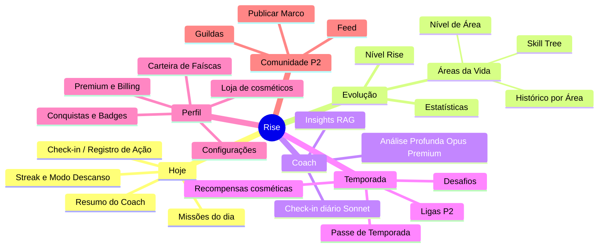

**Regra de profundidade:** nenhum fluxo crítico do Loop Solo deve exigir mais de **2 níveis de navegação** a partir de Hoje. Skill Tree é o destino mais "fundo" e fica em `Evolução → Área → Skill Tree` (2 saltos).

---

## 2. Estrutura de Navegação (web e mobile)

### 2.1 Web — Sidebar persistente + topbar

- **Sidebar esquerda** (colapsável, `data-collapsed`): os 5 destinos de topo com `AreaIcon`/ícone + label; abaixo, o `SparksWalletChip` e avatar com menu. Em telas Premium-gated, ícone com selo `--premium`.
- **Topbar**: breadcrumb contextual à esquerda; à direita busca global (`⌘K`), sino de notificações, FAB `+ Registrar` (também `A`).
- **Conteúdo**: RSC por padrão (Next.js 15 App Router); ilhas client para interações.
- **Responsivo**: < 1024px a sidebar vira drawer; o FAB migra para canto inferior direito (espelhando mobile).

### 2.2 Mobile (Expo) — Tab bar inferior + FAB central

- **Tab bar** com 5 tabs espelhando os destinos web. O **FAB central elevado é o Registro de Ação** (decisão: é a ação mais frequente do dia, merece o ponto ergonômico de maior alcance do polegar).
- **Stacks por tab** (Expo Router): cada tab tem seu próprio stack de navegação; deep links resolvem para a tab correta.
- **Push nativo** abre direto na tela-alvo (ex.: notificação de streak em risco → `/home` com `StreakFlame` em destaque).

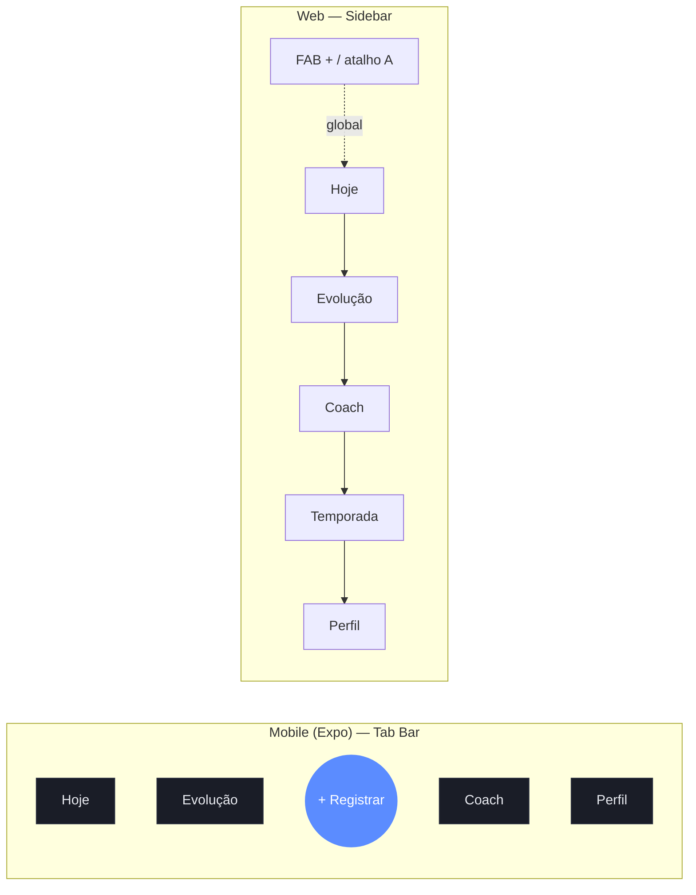

> Decisão de divergência mobile/web: o mobile não expõe **Temporada** como tab dedicada na Fase 1 (5 slots disputados; o polegar central é do Registro). Temporada vive como **card no topo de Hoje** e tela acessível por ali. Na web há espaço de sidebar, então Temporada é item próprio. Quando as Ligas (P2) entram, mobile promove Temporada a tab e a Loja desce para dentro de Perfil. Trade-off aceito: leve inconsistência de paridade em troca de ergonomia mobile real.

---

## 3. Onboarding (cadastro/login → áreas → primeira meta → primeiro XP / aha)

**Objetivo:** levar do zero ao **primeiro `xp.granted`** em menos de 90 segundos, com o "aha" sendo o **primeiro level-up animado** (`LevelUpOverlay`). Anti-abandono guiado (persona Diego): nunca pedir muito antes de entregar a primeira recompensa.

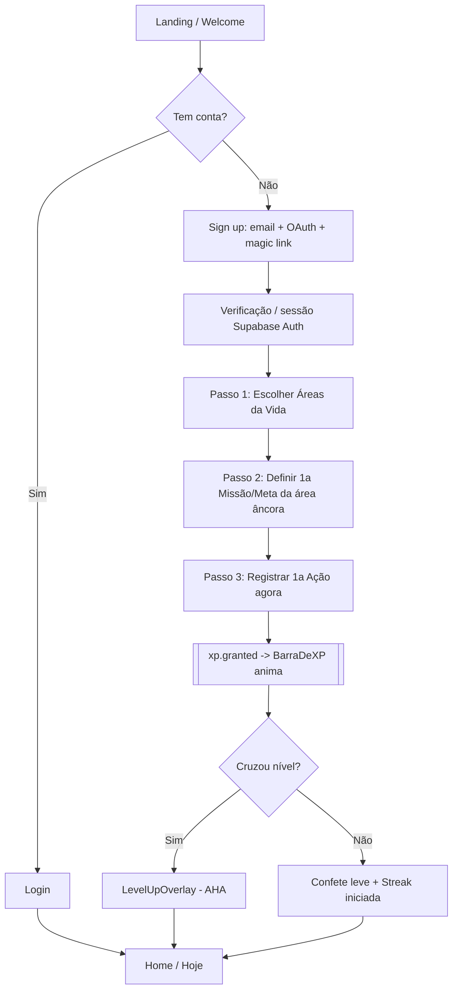

### Passo a passo e estados

| Passo | Tela | Loading | Vazio | Erro | Sucesso |
|---|---|---|---|---|---|
| 0. Welcome | `LandingHero` com tagline "Toda ação conta. Toda evolução aparece." | — | — | — | CTA "Começar" → sign up |
| 1. Auth | `AuthScreen` (email, Google/Apple OAuth, magic link) | spinner no botão; estado "Enviamos um link" para magic link | — | inline: e-mail inválido, OAuth cancelado, rate limit ("Tente em instantes") | sessão criada → onboarding |
| 2. Áreas | grid de `AreaCard` das 14 Áreas canônicas + "Criar Área" | skeleton de cards | n/a (sempre há padrões) | falha de fetch → retry suave | seleção de 3–5 áreas sugerida; mín. 1 |
| 3. 1ª Missão | `MissaoCard` pré-preenchida pela área âncora (ex.: "Estudar 25 min") | — | — | validação de campos | missão criada (`mission.assigned`) |
| 4. 1ª Ação | quick log da missão ("Fiz agora") | otimista, reconcilia no servidor | — | rollback otimista + toast "Não consegui registrar, tentando de novo" | `action.logged` → `xp.granted` → animação |
| 5. Aha | `LevelUpOverlay` ou confete + `StreakFlame` "Dia 1" | — | — | — | entra na Home com tour de 2 dicas dismissíveis |

**Decisões de onboarding:**
- **Áreas custom já no onboarding** (Diego cria "Música"): o picker restrito de cor garante consistência visual (fallback `paleta[hash(areaId) % 12]`).
- **Sem pedir cartão.** Premium/trial não aparece no onboarding; conversão é por valor demonstrado depois.
- **Coach se apresenta no passo 5**, não antes — um `CoachBubble` curto: "Sou seu Coach. Vou acompanhar sua evolução." Nunca "chatbot".
- **i18n desde o passo 0** (pt-BR default, en disponível); copy do glossário.
- **Eventos**: `action_logged`, `level_up` (analytics canônicos PostHog) disparam aqui — são o funil de ativação rumo à North Star (Dias de Evolução).

---

## 4. Fluxo Diário (Home/Hoje → check-in → recompensa)

O coração do produto. Tela **Hoje** = comando do dia.

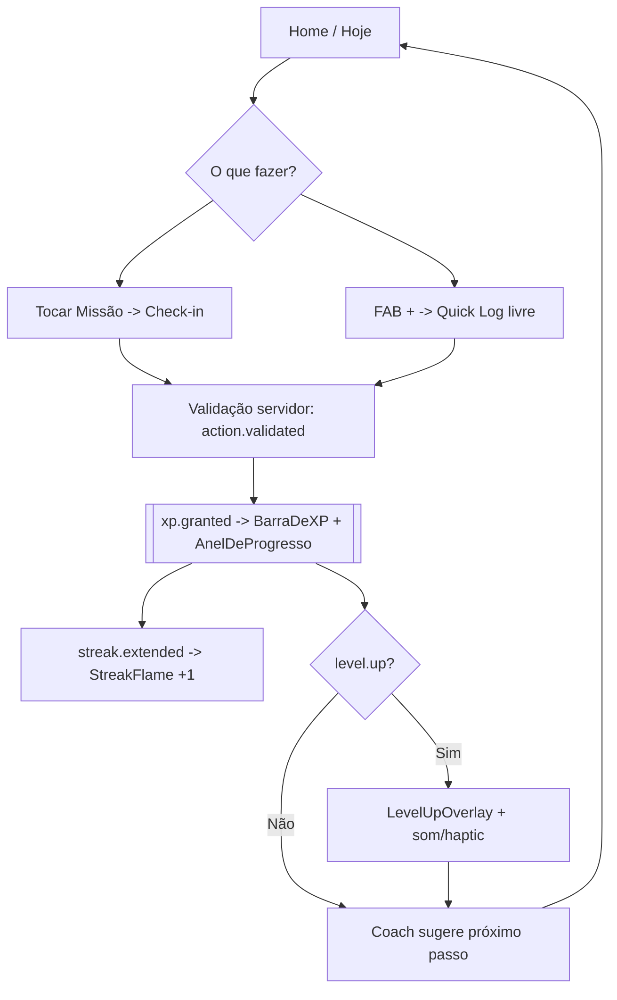

### Anatomia da Home (top → bottom)

1. **Header de identidade:** `LevelBadge` (Nível Rise), saudação do Coach, `StreakFlame` com contagem.
2. **Card de Temporada** (mobile) / banner: progresso do Passe (`season.progress`).
3. **Missões do dia:** lista de `MissaoCard` (diárias/semanais + sugeridas pelo Coach). Check-in 1-tap.
4. **Anéis de Área** ativos hoje: `AnelDeProgresso` por Área da Vida tocada.
5. **Resumo do Coach:** `InsightCard` do dia (Haiku/Sonnet).

### Estados da Home

- **Loading:** skeleton dos cards (sem layout shift; grid base 4px).
- **Vazio (primeiro dia/sem missões):** `EmptyState` "Seu dia está em branco — registre a primeira ação" com CTA para quick log.
- **Erro de sync:** banner não-bloqueante "Sincronizando…"; ações ficam otimistas e reconciliam (servidor é a verdade; `client_action_id` evita duplicata).
- **Sucesso/recompensa:** animação escala com raridade do evento (Comum→Mítica); teto de partículas + cleanup; `motion-reduce` respeitado.

**Decisão:** o check-in não navega para fora da Home — a recompensa acontece **in place**. Tirar o usuário da Home a cada ação quebraria o ritmo do loop. A celebração é overlay, não nova rota.

---

## 5. Criar e Concluir Hábito/Meta

No Rise, **"hábito"** = Missão recorrente; **"meta"** = Missão/objetivo com alvo e prazo. Ambos geram XP ao concluir.

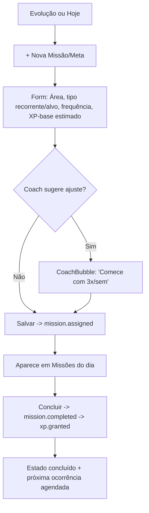

| Etapa | Vazio | Loading | Erro | Sucesso |
|---|---|---|---|---|
| Criar | form vazio com placeholders úteis | — | validação inline (área obrigatória) | `mission.assigned`; toast + leva à lista |
| Sugestão do Coach | sem sugestão se Free atingiu cota Haiku | shimmer no `CoachBubble` | degrada silenciosamente (heurística local) | dica aplicável com 1-tap |
| Concluir | — | otimista | rollback + retry | `mission.completed`, XP some na barra, streak conta |

**Decisão:** o XP de uma missão respeita o **teto diário por área com retornos decrescentes** (anti-grinding). Acima do teto, conta para streak/stats mas não infla XP nem Liga — comunicado de forma neutra ("Já no máximo de XP de Estudos hoje — ainda conta para sua sequência"), nunca como punição.

---

## 6. Subir de Nível / Abrir Skill Tree

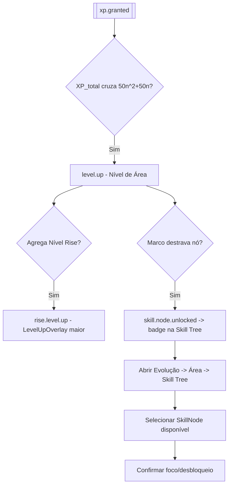

### Navegação até a Skill Tree
`Hoje/Evolução → AreaCard → tela da Área → aba "Árvore" → SkillTree`. A `SkillTree` mostra tronco/ramos/folhas; nós bloqueados em estado fantasma com requisito visível ("Nível 8 + 30 dias").

| Estado | Comportamento |
|---|---|
| Vazio | árvore inicial com só o tronco; folhas em silhueta |
| Loading | render progressivo dos galhos (sem travar scroll) |
| Bloqueado | `SkillNode` esmaecido + tooltip de requisito |
| Disponível | `SkillNode` com glow `--accent-glow` (restrito a progresso) |
| Desbloqueado | animação de `skill.node.unlocked`, badge permanente |

**Decisão:** a curva é **quadrática única** (`50n²+50n`, custo `100·(n+1)`), níveis **derivados do XP Ledger** (recomputáveis) — abrir a Skill Tree nunca exige migração ao rebalancear. O level-up é overlay imediato (feedback AAA); a Skill Tree é o destino "lento" de saborear progresso (chave para Bruno).

---

## 7. Missões e Desafios

- **Missões:** objetivos pessoais (diários/semanais/sugeridos). Vivem em Hoje e na Área.
- **Desafios:** eventos com meta e prazo (Temporada). Individuais já na Fase 1; de guilda/comunidade e pagos na Fase 2.

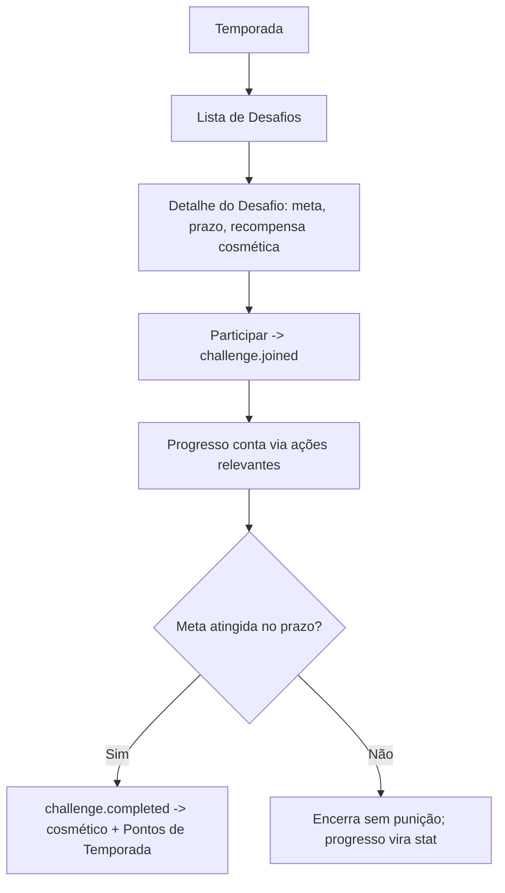

| Estado | Missões | Desafios |
|---|---|---|
| Vazio | "Sem missões — o Coach pode sugerir" + CTA | "Nenhum desafio ativo nesta Temporada" |
| Loading | skeleton de `MissaoCard` | skeleton de cards de desafio |
| Erro | retry; missões locais persistem | retry; participação idempotente |
| Sucesso | `mission.completed` | `challenge.completed`, cosmético entregue |

**Guardrail:** desafios (mesmo pagos, Fase 2) **nunca** dão XP/boost/vantagem — só acesso a programa/curadoria + cosmético. Resultado depende só de progresso real.

---

## 8. Temporada e Leaderboard (Liga)

Temporadas mensais (~30 dias). Reset **apenas** de leaderboard sazonal e Passe; XP/níveis/Skill Trees/Conquistas **nunca** resetam.

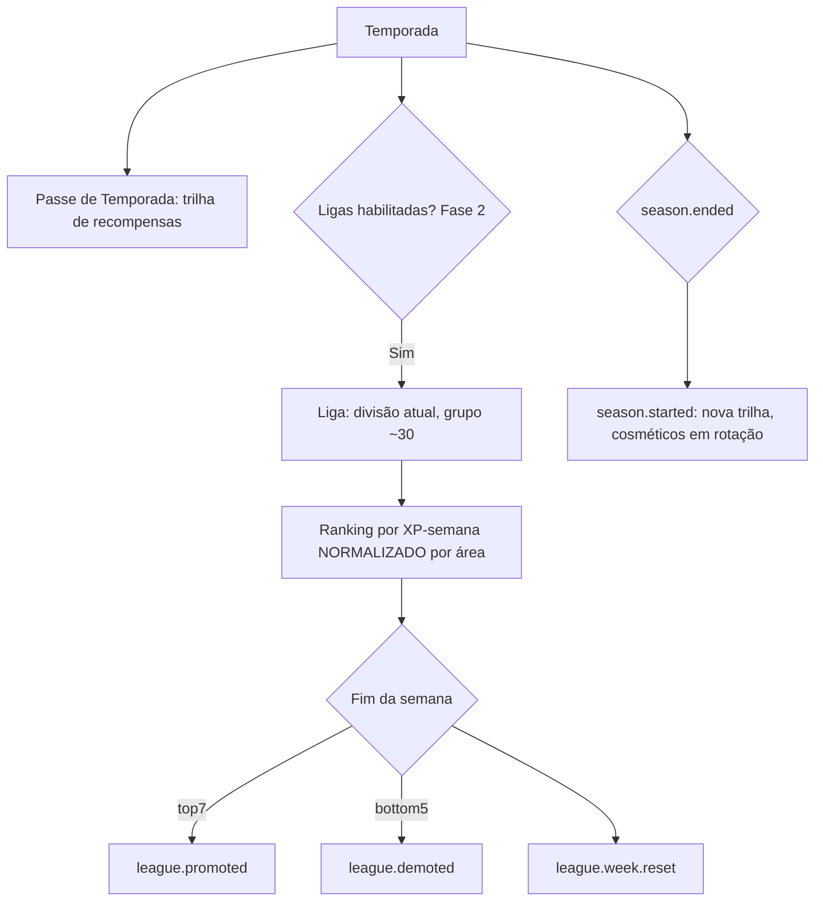

### Telas e estados
- **Passe (`SeasonBanner` + trilha):** progresso PT; recompensas Free e Premium marcadas (`PremiumGate` nas trilhas pagas).
- **Liga (`LigaTier`):** 10 divisões Bronze→Lendária; sua posição no grupo; opt-out disponível (Rankings nunca são impostos).
- **Vazio:** "Sua Temporada começa agora" antes do primeiro `season.progress`.
- **Loading:** ranking carrega de agregado materializado/cache (não subscription massiva).
- **Erro:** ranking mostra última posição conhecida + "atualizando".
- **Sucesso:** animação de promoção; Bronze nunca rebaixa (anti streak-shame estrutural).

**Decisão:** Liga é **Fase 2** (depende de massa). Na Fase 1, Temporada entrega novidade via Passe + cosméticos sazonais (que **retornam em rotação** — anti-FOMO), sem necessidade de competição social.

---

## 9. Feed Social e Publicar Marco (Fase 2)

Feed = exclusivamente progresso (marcos, recordes, streaks, conquistas). Sem selfies/aleatório.

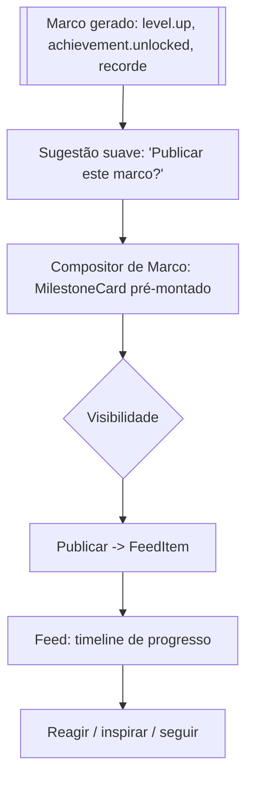

| Estado | Comportamento |
|---|---|
| Vazio (cold-start) | `EmptyState` "Siga pessoas que evoluem" + sugestões; nunca feed fantasma. Por isso Feed só abre na Fase 2, com loop solo provado. |
| Loading | skeleton de `FeedItem`; fan-out na escrita + agregados (Realtime é entrega, não verdade) |
| Erro | "Não consegui carregar — recarregar" |
| Sucesso | publicação otimista; `MilestoneCard` aparece no topo |

**Decisão:** marcos são **derivados de eventos reais** (`achievement.unlocked`, `rise.level.up`), nunca posts livres — o feed não pode virar rede social genérica. Publicar é opt-in e a visibilidade é controlável (privacidade by design, relevante para a ponte com B2B/Renata).

---

## 10. Guilda — Entrar / Criar / Metas Coletivas (Fase 2)

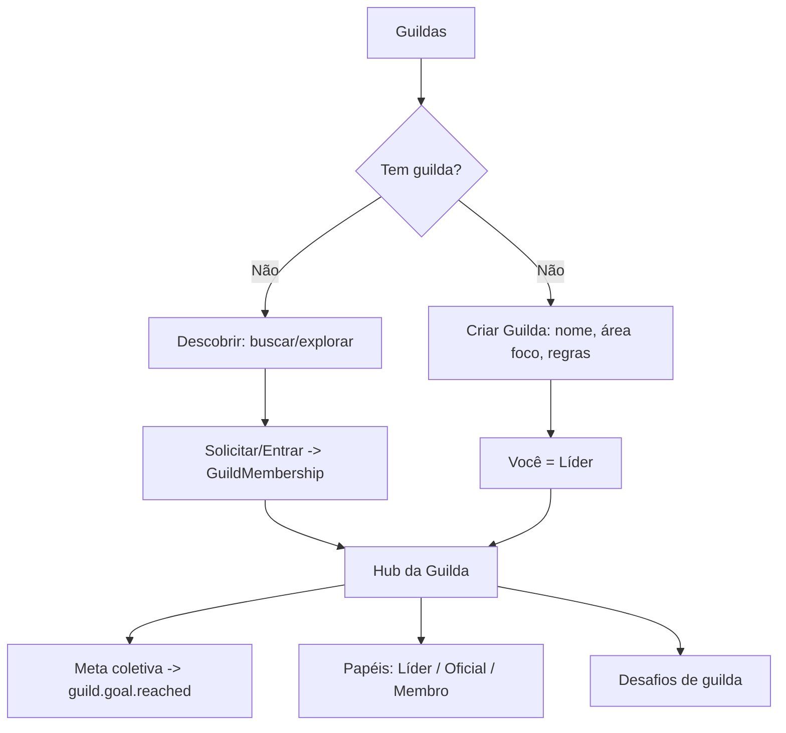

| Estado | Comportamento |
|---|---|
| Vazio | "Você ainda não tem guilda" + descobrir/criar |
| Loading | skeleton do hub |
| Erro | entrada idempotente; "tente novamente" |
| Sucesso | entrada confirmada; meta coletiva visível; `guild.goal.reached` celebra a comunidade |

**Decisão:** guildas dão **responsabilidade coletiva e identidade**, nunca vantagem competitiva comprável. Papéis (Líder/Oficial/Membro) controlam moderação. Guilda Premium (Fase 2) é cosmético/conveniência.

---

## 11. IA Coach — Check-in e Revisão Semanal

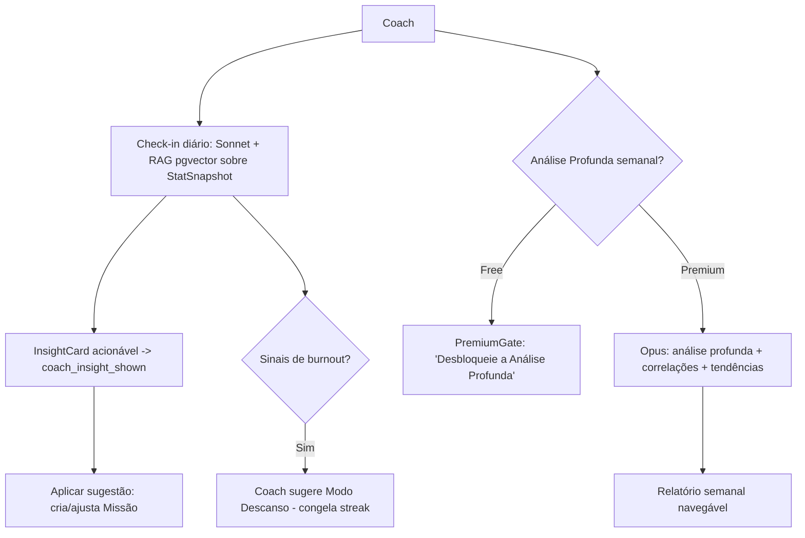

| Camada | Quem | Modelo | Onde |
|---|---|---|---|
| Cotidiano/volume | Free + Premium | heurísticas + `claude-haiku-4-5` | microcopy, classificação, dicas |
| Coach diário | Free (cota ~5–10/dia) + Premium (ilimitado) | `claude-sonnet-4-6` | chat `/coach` |
| Análise Profunda semanal | **Premium** | `claude-opus-4-8` | `PremiumGate` para Free |

**Estados:** loading com shimmer no `CoachBubble`; cota Free esgotada → `PremiumGate` empático ("Você usou seu Coach de hoje"); erro de IA → fallback heurístico local (nunca tela morta). **Tool use validado por Zod**; sugestões viram ações reais (criar Missão, ativar Modo Descanso).

**Decisão:** o Coach é **guardião do bem-estar** — propõe Modo Descanso em sinais de burnout. Equilíbrio emocional é requisito de produto, não enfeite. Jamais "chatbot".

---

## 12. Perfil e Loja de Cosméticos

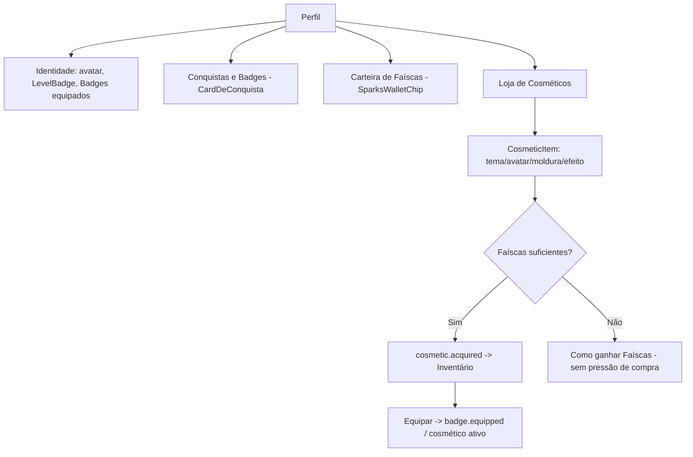

| Estado | Comportamento |
|---|---|
| Vazio | "Equipe sua primeira conquista" / loja com destaques |
| Loading | skeleton de grid de itens |
| Erro | compra idempotente; saldo nunca debita em dobro |
| Sucesso | `cosmetic.acquired`, animação de aquisição transparente |

**Guardrail estrutural:** `SparksWallet`/`CosmeticItem`/`Inventory` são **fisicamente isolados** do `XPLedger` — pay-to-win é **impossível por design**, não só por política. Loja **sem loot box/gacha**, preços sempre visíveis. Faíscas só compram cosmético.

---

## 13. Configurações

`Perfil → Configurações`. Agrupadas para escaneabilidade:

| Grupo | Itens |
|---|---|
| Conta | e-mail, OAuth conectados, senha/magic link, excluir conta (LGPD) |
| Notificações | central de preferências: push nativo/Web Push, e-mail (Resend), horários, "não perturbe" |
| Áreas da Vida | reordenar, arquivar, criar; cor (picker restrito) |
| Privacidade | visibilidade de Marcos, opt-out de Rankings, dados do Coach |
| Idioma e região | pt-BR/en, fuso, preço PPP |
| Aparência | tema (dark default / light), `motion-reduce`, tamanho de texto |
| Assinatura | plano atual, billing, cancelar (simétrico), Faíscas |
| Integrações | HealthKit/Google Fit/GitHub (verdade preferencial anti-fraude) |

**Estados:** salvamento otimista com confirmação inline; erro → "não foi possível salvar" com retry; sem dark patterns no fluxo de cancelamento (cancelar é tão fácil quanto assinar).

---

## 14. Upgrade para Premium (Paywall)

`PremiumGate` é **contextual**: aparece no ponto da intenção (pedir Análise Profunda, abrir stats > 7 dias, trilha de Passe Premium), nunca como modal genérico no boot.

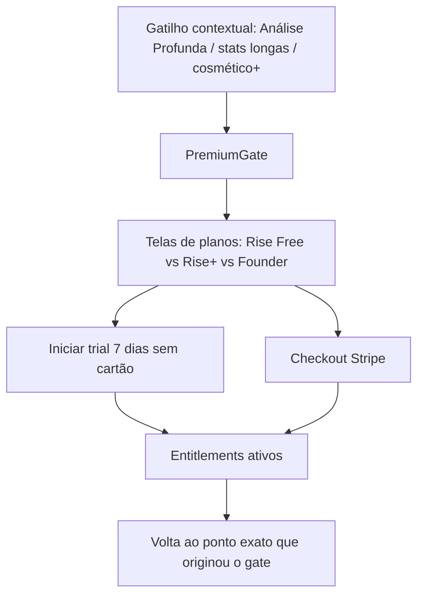

| Tier | Preço | Destrava |
|---|---|---|
| **Rise Free** | grátis | loop solo completo, Coach Haiku + Sonnet com cota, stats 7 dias |
| **Rise+** | R$29,90/mês · R$199/ano · $7,99/$59,99 | Coach Sonnet ilimitado, Análise Profunda Opus, stats profundas, estipêndio de Faíscas |
| **Rise Founder** | R$299 vitalício (limitado) | tudo do Rise+ + badge Founder + price lock |

**Estados:** loading do checkout (Stripe); erro de pagamento → mensagem clara + retry, sem perder contexto; sucesso → volta **exatamente** à intenção original (não joga na Home). Downgrade **preserva** XP/níveis/Conquistas/histórico.

**Decisão:** o plano anual é a âncora (~45% off). Trial sem cartão reduz fricção. `PremiumGate` **nunca** bloqueia progressão central — só profundidade/clareza/beleza. A North Star (Dias de Evolução) é justamente o que **não** se monetiza.

---

## 15. Mapa de Rotas (Web) sugerido

Next.js 15 App Router. `(grupos)` = route groups; `[param]` = dinâmico. RSC por padrão; ilhas client onde houver interação.

```text
/                         -> Landing (público, SEO)
/login                    -> Auth (email/OAuth/magic link)
/signup                   -> Sign up
/onboarding               -> wizard
  /onboarding/areas       -> escolha de Áreas da Vida
  /onboarding/missao      -> 1ª Missão/Meta
  /onboarding/acao        -> 1º Registro de Ação (aha)

(app)  [protectedProcedure / sessão obrigatória]
/home                     -> Hoje (Loop diário)
/evolucao                 -> overview de Áreas + Nível Rise + stats resumidas
/evolucao/[areaId]        -> tela da Área (Nível de Área, histórico)
/evolucao/[areaId]/arvore -> Skill Tree
/evolucao/stats           -> Estatísticas (profundas = premiumProcedure)
/coach                    -> Coach diário (Sonnet)
/coach/analise            -> Análise Profunda semanal (Opus, PremiumGate)
/temporada                -> Passe de Temporada + Desafios
/temporada/desafio/[id]   -> detalhe de Desafio
/temporada/liga           -> Liga/Ranking (Fase 2)
/perfil                   -> identidade + Conquistas + Badges
/perfil/conquistas        -> grade de Conquistas
/perfil/faiscas           -> Carteira de Faíscas
/loja                     -> Loja de Cosméticos
/loja/[itemId]            -> detalhe de CosmeticItem
/config                   -> Configurações (subseções por grupo da §13)
/premium                  -> planos + checkout (Stripe)

(social) [Fase 2, feature-flagged]
/feed                     -> Feed de progresso
/feed/marco/[id]          -> Marco detalhado
/guildas                  -> descobrir/criar
/guildas/[guildId]        -> hub da Guilda

(org) [Fase 3, orgProcedure]
/org                      -> dashboards agregados e anônimos
/org/times/[teamId]       -> visão de time
/org/config               -> SSO, assentos, billing B2B

(admin) [transversal, P0 mínimo]
/admin                    -> feature flags, kill switch, suporte, anti-fraude
```

**Deep links mobile (Expo Router):** espelham as rotas web 1:1 via esquema `rise://` (ex.: `rise://home`, `rise://evolucao/{areaId}/arvore`, `rise://coach`). Push nativo resolve para a tela-alvo com a tab correta selecionada.

**Convenções de rota:**
- Rotas de leitura profunda (`/evolucao/stats` profundas, `/coach/analise`) são `premiumProcedure` no tRPC; o `PremiumGate` é renderizado server-side quando o entitlement falta (sem flicker).
- `/feed`, `/guildas` ficam atrás de feature flag de Fase 2 — não renderizam itens de menu até liberadas.
- Toda rota `(app)` exige sessão; RLS por `user_id` é defense-in-depth (e `org_id` na Fase 3).

---

## 16. Princípios de decisão (síntese)

1. **Um toque do progresso.** Registro de Ação é global (FAB + atalho `A`); a recompensa acontece in place na Home.
2. **Uma IA, dois chromes.** Sidebar (web) e tab bar + FAB central (mobile) servem a mesma árvore; divergências são ergonômicas e justificadas (Temporada como card no mobile Fase 1).
3. **Navegação honesta.** Destinos de Fase 2/3 só aparecem desbloqueados; nada de botões mortos nem feed fantasma (anti cold-start).
4. **Paywall no ponto da intenção.** `PremiumGate` contextual que devolve o usuário exatamente onde estava; jamais bloqueia progressão.
5. **Estados sempre definidos.** Todo fluxo tem vazio/loading/erro/sucesso desenhados — `EmptyState` convida, otimismo reconcilia, erro nunca trava.
6. **Profundidade a 2 saltos.** Skill Tree, stats e Análise Profunda ficam perto, sem poluir o loop diário.
7. **Tudo serve a North Star.** Cada rota existe para aumentar Dias de Evolução por usuário ativo — e por isso o caminho do progresso nunca é vendido.
